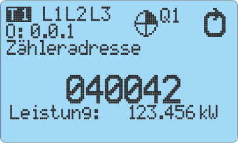

# BSM-WS36A Display

## Baud Rate and Device Address

The currently set baud rate and device address is shown at the meter's display
at the screen _Zähleradresse_/_Device address_ in an encoded representation.

This data is presented in the form _BB0AAA_ where _BB_ is the baud rate index
as given below and _AAA_ the decimal value of the Modbus device address. The
following baud rate indices _BB_ are used:

| Index | Baud Rate  |
| ----: | ---------: |
| 00    | 1,200 Bd   |
| 01    | 2,400 Bd   |
| 02    | 4,800 Bd   |
| 03    | 9,600 Bd   |
| 04    | 19,200 Bd  |
| 05    | 38,400 Bd  |
| 06    | 57,600 Bd  |
| 07    | 115,200 Bd |
| 08    | 230,400 Bd |
| 09    | 460,800 Bd |
| 10    | 921,600 Bd |

So the screen above shows baud rate index 04 (19,200 Bd) and device address 042
(42).
