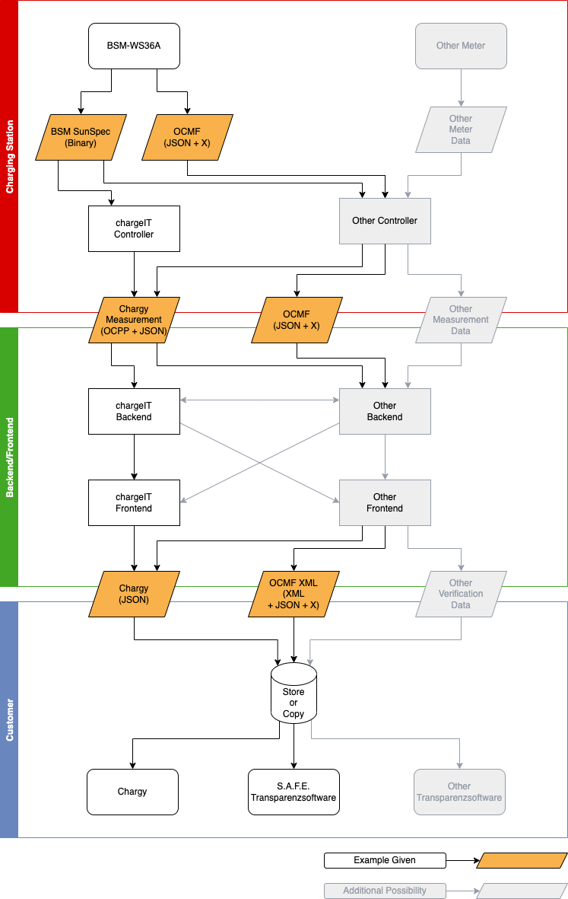

# Electric Vehicle Charging Exchange Data

## Overview

There are many options for integrating the BSM-WS36A into electric vehicle
charging infrastructure. It facilitates this by providing signed data in two
output formats:

1. Its [proprietary snapshot format](snapshots.md)
    - Where the actually signed data is based on an [abstract
      representation](snapshots.md#verifying-a-snapshot-with-the-bsm-tool)
      snapshot data
    - Allowing to translate snapshot data in other forms where the abstract
      representation could be reconstructed from
    - Allows passing on signed data in a variety of derived formats
2. [OCMF](ocmf.md)
    - Derived from the proprietary snapshot format
    - "Signed as seen" and therefor with an individual signature
    - Passed on literally until verification

The BSM-WS36A is already integrated with chargeIT mobility's solutions
(charging controller, backend, frontend, and Chargy for validation) and easily
integrates with others.

There are multiple paths from signed data generated by the BSM-WS36A and the
customer validating it. The diagram shows the involved data formats as
parallelograms: the ones with an orange background are shown and discussed in
these examples while the gray ones are shown here just to sketch furthermore
possible formats.

The paths discussed are towards the following two applications for validating
charging data using a so-called Transparenzsoftware:

1. Chargy
    - Validates Chargy, OCMF, ...
    - [Certified
      release](https://www.chargeit-mobility.com/wissen-tipps/validierung/)
    - [Pre-release](https://github.com/chargeITmobility/ChargyDesktopApp/releases)
      supporting the new chargeIT-format with the BSM-WS36A which currently undergoes certification
    - Open source license
    - Available without any restrictions or fees

2. [S.A.F.E. Transparenzsoftware](https://www.safe-ev.de/de/transparenzsoftware.php)
    - Validates OCMF, ...
    - Certified release
    - S.A.F.E. membership is required (with fees)

As sketched out in the diagram, there are more solutions available and possible
for validating charging data.

## Chargy JSON and Custom Formats

For validating charging data with Chargy, chargeIT mobility's solutions take
the following steps shown below. These are also a blueprint for defining and
using custom formats along this path. These steps are:

- Charging station
    - The controller [creates](snapshots.md#snapshot-creation) snapshots and
      [fetches their data](snapshots.md#snapshot-data-1) from the start or stop event of the charging process
    - It converts snapshot data into [Chargy's snapshot data JSON
      format](chargy.md#snapshot-data) (single format)
    - It sends this format via OCPP to the backend (start + stop)

- Backend and frontend
    - Receive and handles snapshot data for a charging process (start + stop) in [Chargy's
      snapshot data JSON format](chargy.md#snapshot-objects)
    - Generate [Chargy JSON data](chargy.md#chargy-json-format) from the
      individual snapshot data and its information about the charge point (meta format)
    - Backend submits signed data to the frontend
    - Provide the meta format to the customer (for example as download via its web
      UI)

- Customer
    - Copies charging data from the frontend and pastes it into Chargy for
      validation
    - Or downloads charging data from the frontend, stores it, and opens the
      files with Chargy.

Or to phrase it more technically - this data path consists of:

- [Converting BSM-WS36A snapshot data into a custom transport
  format](chargy.md#snapshot-data-1) which allows to reconstruct the abstract
  representation of the signed data
- Combining and augmenting this data into [Chargy JSON
  data](chargy.md#chargy-json-format)
- Validating Chargy JSON data
    - Reconstructing the [abstract
      representation](snapshots.md#abstract-data-representation) as
      shown by example in [Abstract Data Representation
      Example](chargy.md#abstract-data-representation-example)
    - Validating the signature for the abstract data representation
    - Performing [consistency checks](chargy.md#signature-verification)

## OCMF

In contrast to the abstract data representation used by BSM-WS36A's snapshots,
in OCMF the concrete data representation gets signed and requires passing along
this data literally along the path. So the steps here are:

- Charging station
    - The controller [creates](snapshots.md#snapshot-creation) snapshots and
      [fetches their OCMF 
      respresentation](ocmf.md#getting-the-ocmf-representation) from the start or stop event of the charging process
    - It directly passes the OCMF data to a backend (start + stop)

- Backend and frontend
    - Receive and handles snapshot data in OCMF format (start + stop)
    - Assemble [OCMF XML data](ocmf.md#ocmf-xml) from the individual snapshots
    - Backend submits signed data to the frontend
    - Provide the OCMF XML to the customer (for example as download via its web UI)

- Customer
    - Downloads charging data from the frontend, stores it, and opens the file
      with the S.A.F.E. Transparenzsoftware

## Special Case Pretty Restricted Data Size

There are scenarios where the amount of data which could be transmitted in a
single message is too low for snapshot or charging data to fit in. In such a
case one of the following approaches might help out:

1. If the restriction applies only to a single message and the backend could
   reassemble message fragments, the data could just be split up among multiple
   messages

2. If the data has to be transmitted within a single message, then compression
   might come to the rescue
    - Could be applied to either snapshot data or charging data
    - Compressing the complete charging data at once usually gives a better
      ratio than compressing snapshots individually
    - Compressing the BSM-WS36A's binary snapshot data or its abstract
      representation usually gives smaller results than compressing Chargy JSON
      or OCMF

3. If the above do not work out, the actual data could be shared securely via a
   side channel (storage) and only identifiers (like URLs) are transmitted in
   the actual message
