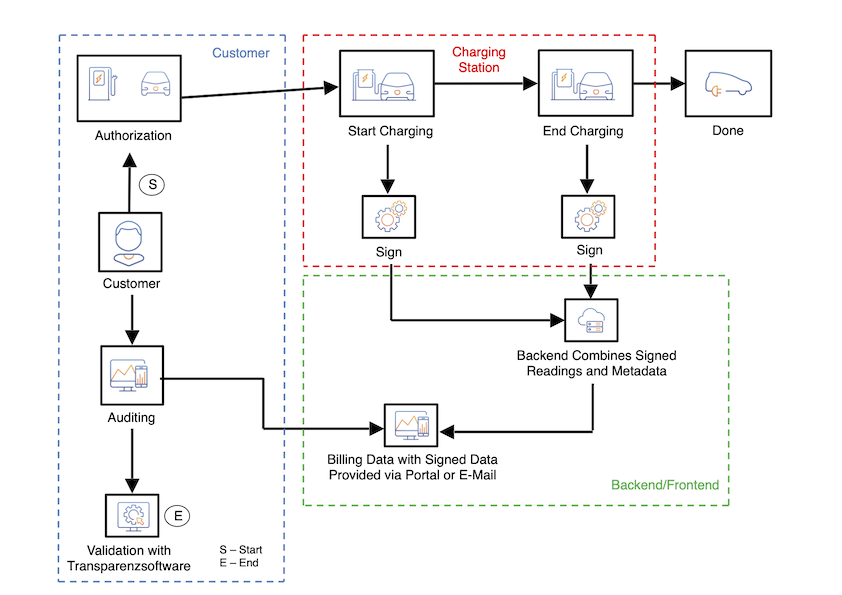
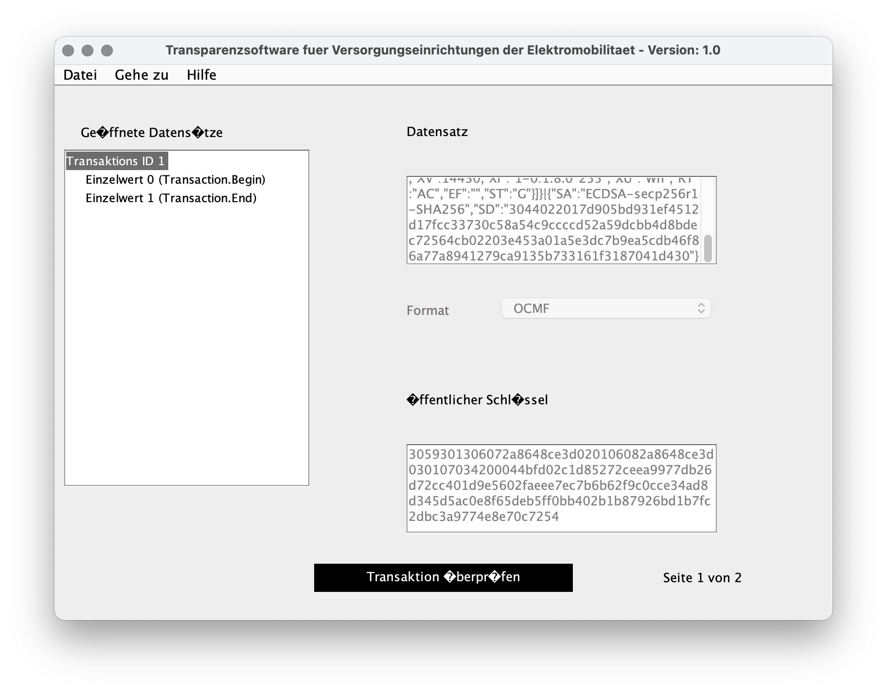
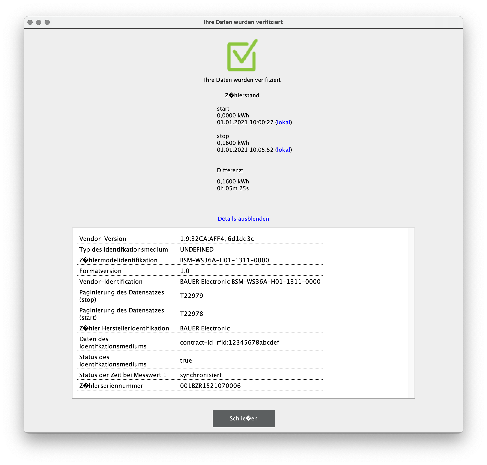

# Electric Vehicle Charging

The BSM-WS36A facilitates setting up electric vehicle charging applications in
three ways:

1. Taking and signing snapshots of data relevant for billing
2. Its ability to directly control an external contactor for controlling energy
   delivery and its controlled operation for recording snapshot data with the
   contactor turned off
3. Direct output of
   [OCMF](https://github.com/SAFE-eV/OCMF-Open-Charge-Metering-Format) data
   allowing end-user validation of billing data with commonly used and
   available software without the need for separate signing

The following sections demonstrate how to make use of them.


## Typical Setup

Core components of an electric vehicle charging application are the meter
itself and a contactor with appropriate auxiliary contacts for providing
feedback. [Hardware Setup](prerequisites.md#hardware-setup) shows the
single-phase setup we in the example below:


For charging electric cars, a three-phase installation is more common though.

If epoch time information is important for billing, an external controller is
required for providing it to the meter on a regular basis as described in
[Setting and Updating Time](time.md).


## Charging Scenario

### Overview

This example shows aspects of a typical charging scenario as sketched below:



The backend in this example generates OCMF-XML envelopes for billing data. But
every data format which implicitly or explicitly supports passing the actual
signed data could be generated from the snapshot data.


### Updating Time Information

The time information is assumed to be up to date. It could be set and updated
as described in [Setting and Updating Time](time.md). This needs to be done on
a regular basis.

shown below:
```
$ bsmtool set bsm/epoch=1609491600 bsm/tzo=60
```
```
--> 2a 10 9d44 0003 06 5feee490003c d4b0
<-- 2a 10 9d44 0003 e9aa
```


### Setting Identification Data

The BSM-WS36A provides three string [metadata points](snapshots.md#metadata)
_Meta1_, _Meta2_, and _Meta3_ which get recorded and signed when crating a
snapshot.

These three data points could be used according to the application's needs when
generating billing data from the regular snapshots. When using the meter's OCMF
representation, only _Meta1_ will be included as customer identification data
_ID_.

This example sets and uses the follwing demo data

- Customer identification data _chargeIT up 12*4, id: 12345678abcdef_ set as _Meta1_
- Some more demo data _demo data 2_ set as _Meta2_
- _Meta3_ left in its initial empty state

where _12345678abcdef_ is meant to be the identification from an RFID
identification tag. This data could be set with the BSM Tool:
```
$ bsmtool set 'bsm/meta1=chargeIT up 12*4, id: 12345678abcdef' 'bsm/meta2=demo data 2'
```
```
--> 2a 10 9d57 0078 f0 63686172676549542075702031322a342c2069643a203132333435363738616263646566000000000000000000000000000000000000000000000000000000000000000000000000000000000000000000000000000000000000000000000000000000000000000000000000000000000000000000000000000000000000000000000000000000000000000064656d6f206461746120320000000000000000000000000000000000000000000000000000000000000000000000000000000000000000000000000000000000000000000000000000000000000000000000000000000000000000000000000000000000 a4eb
<-- 2a 10 9d57 0078 584c
```


### Start of Charging

Creating a _Signed Turn-On Snapshot_ starts the charging process by recording
the baseline data and turning on the contactor. [Snapshot
Creation](snapshots.md#snapshot-creation) gives the details about this
procedure.


#### Creating the _Signed Turn-On Snapshot_

Create and read the _Signed Turn-On Snapshot_ as follows:
```
$ bsmtool get-snapshot stons
Updating 'stons' succeeded
Snapshot data:
bsm_snapshot:
    fixed:
        Typ: 1
        St: 0
        RCR: None
        TotWhImp: 14430 Wh
        W: 0.0 W
        MA1: 001BZR1520200007
        RCnt: 2064
        OS: 352851 s
        Epoch: 1609491622 s
        TZO: 60 min
        EpochSetCnt: 224
        EpochSetOS: 352832 s
        DI: 1
        DO: 0
        Meta1: chargeIT up 12*4, id: 12345678abcdef
        Meta2: demo data 2
        Meta3: None
        Evt: 0
        NSig: 48
        BSig: 70
    repeating blocks blob:
        Sig: 304402201bfb63da4a6ea54d5dec4579cb029d435b9391e85587905d740d711867650860022008f16665b60dedeccb0bb061c49b8bb68e24754c600269f6a74bd020e72caf2e
```
```
--> 2a 10 9f4a 0001 02 0002 ac03
<-- 2a 10 9f4a 0001 0810
--> 2a 03 9f49 0064 bdf8
<-- 2a 03 c8 00010000000000000000385e000000000001303031425a523135323032303030303700000810000562535feee4a6003c000000e0000562400001000063686172676549542075702031322a342c2069643a2031323334353637386162636465660000000000000000000000000000000000000000000000000000000000000000000000000000000000000000000000000000000000000000000000000000000000000000000000000000000000000000000000000000000000000000000000000000000000000000 a572
--> 2a 03 9fad 007d 3c05
<-- 2a 03 fa 64656d6f206461746120320000000000000000000000000000000000000000000000000000000000000000000000000000000000000000000000000000000000000000000000000000000000000000000000000000000000000000000000000000000000000000000000000000000000000000000000000000000000000000000000000000000000000000000000000000000000000000000000000000000000000000000000000000000000000000000000000000000000000000000000000000000000000000000000000000300046304402201bfb63da4a6ea54d5dec4579cb029d435b9391e85587905d740d711867650860022008f16665 4985
--> 2a 03 a02a 001b 0012
<-- 2a 03 36 b60dedeccb0bb061c49b8bb68e24754c600269f6a74bd020e72caf2e0000000000000000000000000000000000000000000000000000 daa2
```

#### Key Start Snapshot Data Points

Let's have a quick look at its key data points:

- Type and status
    - This is a [_Signed Turn-On
      Snapshot_](../../bauer_bsm/bsm/models/smdx_64901.xml#L6) as indicated by
      [_Typ_](../../bauer_bsm/bsm/models/smdx_64901.xml#L78)
    - It has been [created
      successfully](../../bauer_bsm/bsm/models/smdx_64901.xml#L10) according to
      its status [_St_](../../bauer_bsm/bsm/models/smdx_64901.xml#L115)
- Power and energy
    - The reference cumulative register
      [_RCR_](../../bauer_bsm/bsm/models/smdx_64901.xml#L176) which will show
      the energy consumption at the end has been reset to zero
    - [_TotWhImp_](../../bauer_bsm/bsm/models/smdx_64901.xml#L184) gives the
      total energy consumption tracked by this meter and could be used for
      computing the energy consumption of the actual charging process as the
      delta between start and end
    - It was taken with no active power
      ([_W_](../../bauer_bsm/bsm/models/smdx_64901.xml#L192) = 0 Wh) as it
      should be the case with the contactor turned off
- Time and counters
    - Let's remember the response counter
      [_RCnt_](../../bauer_bsm/bsm/models/smdx_64901.xml#L205) 2,064 for later
    - It has valid time information in _Epoch_ and _TZO_
- Metadata points _Meta1_ and _Meta2_ contain the previously set metadata


#### Start OCMF Representation

The snapshot is valid and so its OCMF representation could be read from _OCMF
Signed Turn-On Snapshot_ with the BSM Tool:
```
$ bsmtool get ostons
bsm_ocmf:
    Typ: 1
    St: 0
    O: OCMF|{"FV":"1.0","GI":"BAUER Electronic BSM-WS36A-H01-1311-0000","GS":"001BZR1520200007","GV":"1.7:97B4:505A, d939f6f","PG":"T2064","MV":"BAUER Electronic","MM":"BSM-WS36A-H01-1311-0000","MS":"001BZR1520200007","IS":true,"IT":"UNDEFINED","ID":"chargeIT up 12*4, id: 12345678abcdef","RD":[{"TM":"2021-01-01T10:00:22,000+0100 S","TX":"B","RV":0,"RI":"1-0:1.8.0*198","RU":"Wh","XV":14430,"XI":"1-0:1.8.0*255","XU":"Wh","RT":"AC","EF":"","ST":"G"}]}|{"SA":"ECDSA-secp256r1-SHA256","SD":"3044022017d905bd931ef4512d17fcc33730c58a54c9ccccd52a59dcbb4d8bdec72564cb02203e453a01a5e3dc7b9ea5cdb46f86a77a8941279ca9135b733161f3187041d430"}
```
```
--> 2a 03 a2bb 0002 918d
<-- 2a 03 04 00010000 30f1
--> 2a 03 a2bd 007d 306c
<-- 2a 03 fa 4f434d467c7b224656223a22312e30222c224749223a22424155455220456c656374726f6e69632042534d2d57533336412d4830312d313331312d30303030222c224753223a22303031425a5231353230323030303037222c224756223a22312e373a393742343a353035412c2064393339663666222c225047223a225432303634222c224d56223a22424155455220456c656374726f6e6963222c224d4d223a2242534d2d57533336412d4830312d313331312d30303030222c224d53223a22303031425a5231353230323030303037222c224953223a747275652c224954223a22554e444546494e4544222c224944223a22636861726765 e226
--> 2a 03 a33a 007d 81b9
<-- 2a 03 fa 49542075702031322a342c2069643a203132333435363738616263646566222c225244223a5b7b22544d223a22323032312d30312d30315431303a30303a32322c3030302b303130302053222c225458223a2242222c225256223a302c225249223a22312d303a312e382e302a313938222c225255223a225768222c225856223a31343433302c225849223a22312d303a312e382e302a323535222c225855223a225768222c225254223a224143222c224546223a22222c225354223a2247227d5d7d7c7b225341223a2245434453412d7365637032353672312d534841323536222c225344223a223330343430323230313764393035626439 3f39
--> 2a 03 a3b7 0078 d191
<-- 2a 03 f0 333165663435313264313766636333333733306335386135346339636363636435326135396463626234643862646563373235363463623032323033653435336130316135653364633762396561356364623436663836613737613839343132373963613931333562373333313631663331383730343164343330227d00000000000000000000000000000000000000000000000000000000000000000000000000000000000000000000000000000000000000000000000000000000000000000000000000000000000000000000000000000000000000000000000000000000000000000000000000000000000000 93b9
```


#### Key Start OCMF Values

[Pretty-printed](ocmf.md#ocmf-json-payload), the _OCMF Signed Turn-On
Snapshot_'s payload looks like:
```json
{
  "FV": "1.0",
  "GI": "BAUER Electronic BSM-WS36A-H01-1311-0000",
  "GS": "001BZR1520200007",
  "GV": "1.7:97B4:505A, d939f6f",
  "PG": "T2064",
  "MV": "BAUER Electronic",
  "MM": "BSM-WS36A-H01-1311-0000",
  "MS": "001BZR1520200007",
  "IS": true,
  "IT": "UNDEFINED",
  "ID": "chargeIT up 12*4, id: 12345678abcdef",
  "RD": [
    {
      "TM": "2021-01-01T10:00:22,000+0100 S",
      "TX": "B",
      "RV": 0,
      "RI": "1-0:1.8.0*198",
      "RU": "Wh",
      "XV": 14430,
      "XI": "1-0:1.8.0*255",
      "XU": "Wh",
      "RT": "AC",
      "EF": "",
      "ST": "G"
    }
  ]
}
```

Let's have a quick lock at its key data points too:

- Type and status
    - Its type is indicated by the transaction _TX_ = _B_ (for beginning)
    - Its status _ST_ indicates that it is _good_ = _G_
- Power and energy
    - The reference cumulative register is used as the primary reading value
      _RV_
    - The total energy consumption is given as the additional value _XV_
    - The OCMF data does not contain the active power
- Time and counters
    - It provides the response counter as the snapshot in _PG_ (for pagination)
      prefixed with _T_ for a reading in a transactional context
    - Epoch time information is given in ISO 8601 format instead of epoch
      seconds and timezone offset
- _Meta1_ is used as identification data _ID_ and the identification type
  always _IT_ always returns _UNDEFINED_


### Intermediate Values

Intermediate values for the current charging process might be required for
example for displaying status information. There are two ways to get them:

- Just reading out the desired data points from the [AC
  Meter](modbus-interface.md#model-instances) and [_Signing
  Meter_](modbus-interface.md#model-instances) model instances

- Creating [_Signed Current Snapshot_](modbus-interface.md#model-instances)s

Both of them provide data suitable for status updates. The latter associates
energy consumption with a timestamp but increases the response counter so that
this one will reflect the number of intermediate snapshots taken at the end of
the charging process.


### End of Charging

Creating a _Signed Turn-Off Snapshot_ ends the charging process by turning of
the contactor and recoding the snapshot data. Again, [Snapshot Creation]() gives
the details about this procedure.


#### Creating the Signed Turn-Off Snapshot

Creating and reading the _Signed Turn-Off Snapshot_ works in analog to
[creating the _Signed Turn-On Snapshot_](#creating-the-signed-turn-on-snapshot)
and as follows:
```
$ bsmtool get-snapshot stoffs
Updating 'stoffs' succeeded
Snapshot data:
bsm_snapshot:
    fixed:
        Typ: 2
        St: 0
        RCR: 150 Wh
        TotWhImp: 14590 Wh
        W: 0.0 W
        MA1: 001BZR1520200007
        RCnt: 2065
        OS: 353162 s
        Epoch: 1609491933 s
        TZO: 60 min
        EpochSetCnt: 224
        EpochSetOS: 352832 s
        DI: 1
        DO: 0
        Meta1: chargeIT up 12*4, id: 12345678abcdef
        Meta2: demo data 2
        Meta3: None
        Evt: 0
        NSig: 48
        BSig: 70
    repeating blocks blob:
        Sig: 304402204fb0de8e38e9e23ebe52e2b15397fe1313cd4753b88b0920b58edad6127448a80220408a02dc0f65545637201f912c7e0107669149f60722e8365ba0b1f5f25936bb
```
```
--> 2a 10 a048 0001 02 0002 62e2
<-- 2a 10 a048 0001 a5c4
--> 2a 03 a047 0064 d02f
<-- 2a 03 c8 0002000000000096000038fe000000000001303031425a5231353230323030303037000008110005638a5feee5dd003c000000e0000562400001000063686172676549542075702031322a342c2069643a2031323334353637386162636465660000000000000000000000000000000000000000000000000000000000000000000000000000000000000000000000000000000000000000000000000000000000000000000000000000000000000000000000000000000000000000000000000000000000000000 a6e7
--> 2a 03 a0ab 007d d010
<-- 2a 03 fa 64656d6f206461746120320000000000000000000000000000000000000000000000000000000000000000000000000000000000000000000000000000000000000000000000000000000000000000000000000000000000000000000000000000000000000000000000000000000000000000000000000000000000000000000000000000000000000000000000000000000000000000000000000000000000000000000000000000000000000000000000000000000000000000000000000000000000000000000000000000300046304402204fb0de8e38e9e23ebe52e2b15397fe1313cd4753b88b0920b58edad6127448a80220408a02dc 9791
--> 2a 03 a128 001b a02e
<-- 2a 03 36 0f65545637201f912c7e0107669149f60722e8365ba0b1f5f25936bb0000000000000000000000000000000000000000000000000000 cbe0
```

#### Key End Snapshot Data Points

Let's look one more time at the snapshot's key data points and compare them to
the _Signed Turn-On Snapshot_ taken at the start of charging:

- Type and status
    - This is a [_Signed Turn-Off
      Snapshot_](../../bauer_bsm/bsm/models/smdx_64901.xml#L7) as indicated by
      [_Typ_](../../bauer_bsm/bsm/models/smdx_64901.xml#L78)
    - It has been [created
      successfully](../../bauer_bsm/bsm/models/smdx_64901.xml#L10) according to
      its status [_St_](../../bauer_bsm/bsm/models/smdx_64901.xml#L115)
- Power and energy
    - The reference cumulative register
      [_RCR_](../../bauer_bsm/bsm/models/smdx_64901.xml#L176) started at zero
      and now shows the energy delivered during this charging process: 150 Wh
    - The total energy delivered,
      [_TotWhImp_](../../bauer_bsm/bsm/models/smdx_64901.xml#L184), increased
      from 14,430 Wh to 14,590 Wh which gives a consumption of 160 Wh. This is
      one least significant digit more than the reading from _RCR_ due to their
      [internal state](snapshots.md#energy-and-power) for continuously tracking
      energy consumption.
    - Again, there is no active power
      ([_W_](../../bauer_bsm/bsm/models/smdx_64901.xml#L192) = 0 Wh) since
      power delivery got cut before recording the snapshot data
- Metadata is still the same as in _Signed Turn-On Snapshot_


#### OCMF End Representation

After successfully creating the _Signed Turn-Off Snapshot_, its OCMF
representation can be read from _OCMF Signed Turn-Off Snapshot_:
```
$ bsmtool get ostoffs
bsm_ocmf:
    Typ: 2
    St: 0
    O: OCMF|{"FV":"1.0","GI":"BAUER Electronic BSM-WS36A-H01-1311-0000","GS":"001BZR1520200007","GV":"1.7:97B4:505A, d939f6f","PG":"T2065","MV":"BAUER Electronic","MM":"BSM-WS36A-H01-1311-0000","MS":"001BZR1520200007","IS":true,"IT":"UNDEFINED","ID":"chargeIT up 12*4, id: 12345678abcdef","RD":[{"TM":"2021-01-01T10:05:33,000+0100 S","TX":"E","RV":150,"RI":"1-0:1.8.0*198","RU":"Wh","XV":14590,"XI":"1-0:1.8.0*255","XU":"Wh","RT":"AC","EF":"","ST":"G"}]}|{"SA":"ECDSA-secp256r1-SHA256","SD":"304502206557e44b012431b80b603390d6ed5381b5c774e823b8dd99c078d25b5c04a20d022100ca14532a0185ba0feb0a9f60949d33bc682bc786e8bbd8df174cab2668e4160f"}
```
```
--> 2a 03 a431 0002 b0ef
<-- 2a 03 04 00020000 c0f1
--> 2a 03 a433 007d 50cf
<-- 2a 03 fa 4f434d467c7b224656223a22312e30222c224749223a22424155455220456c656374726f6e69632042534d2d57533336412d4830312d313331312d30303030222c224753223a22303031425a5231353230323030303037222c224756223a22312e373a393742343a353035412c2064393339663666222c225047223a225432303635222c224d56223a22424155455220456c656374726f6e6963222c224d4d223a2242534d2d57533336412d4830312d313331312d30303030222c224d53223a22303031425a5231353230323030303037222c224953223a747275652c224954223a22554e444546494e4544222c224944223a22636861726765 2fb6
--> 2a 03 a4b0 007d a127
<-- 2a 03 fa 49542075702031322a342c2069643a203132333435363738616263646566222c225244223a5b7b22544d223a22323032312d30312d30315431303a30353a33332c3030302b303130302053222c225458223a2245222c225256223a3135302c225249223a22312d303a312e382e302a313938222c225255223a225768222c225856223a31343539302c225849223a22312d303a312e382e302a323535222c225855223a225768222c225254223a224143222c224546223a22222c225354223a2247227d5d7d7c7b225341223a2245434453412d7365637032353672312d534841323536222c225344223a22333034353032323036353537653434 db82
--> 2a 03 a52d 0078 f136
<-- 2a 03 f0 62303132343331623830623630333339306436656435333831623563373734653832336238646439396330373864323562356330346132306430323231303063613134353332613031383562613066656230613966363039343964333362633638326263373836653862626438646631373463616232363638653431363066227d000000000000000000000000000000000000000000000000000000000000000000000000000000000000000000000000000000000000000000000000000000000000000000000000000000000000000000000000000000000000000000000000000000000000000000000000000000 95a1
```


#### Key End OCMF Values

[Pretty-printed](ocmf.md#ocmf-json-payload), the _OCMF Signed Turn-Off
Snapshot_ looks as follows:
```json
{
  "FV": "1.0",
  "GI": "BAUER Electronic BSM-WS36A-H01-1311-0000",
  "GS": "001BZR1520200007",
  "GV": "1.7:97B4:505A, d939f6f",
  "PG": "T2065",
  "MV": "BAUER Electronic",
  "MM": "BSM-WS36A-H01-1311-0000",
  "MS": "001BZR1520200007",
  "IS": true,
  "IT": "UNDEFINED",
  "ID": "chargeIT up 12*4, id: 12345678abcdef",
  "RD": [
    {
      "TM": "2021-01-01T10:05:33,000+0100 S",
      "TX": "E",
      "RV": 150,
      "RI": "1-0:1.8.0*198",
      "RU": "Wh",
      "XV": 14590,
      "XI": "1-0:1.8.0*255",
      "XU": "Wh",
      "RT": "AC",
      "EF": "",
      "ST": "G"
    }
  ]
}
```

Let's have a quick look at its key data points:

- Type and status
    - Its type is indicated by the transaction _TX_ = _E_ (for end)
    - Its status _ST_ = _G_ stands for good
- Power and energy
    - The primary reading value _RV_ now shows the energy consumption from the
      refernce cumulative register: 150 Wh
    - The total energy consumption is given by _XV_
    - The OCMF data does not contain the active power
- Time and counters
    - The response counter _PG_ (prefixed with _T_) gives the value 2,065 and
      is the successor of the start response counter
    - Epoch time information is given in ISO 8601 format
- The identification data _ID_ taken from _Meta1_ has the same value as in the
  start OCMF data


### Billing Data and Verification

Having _Signed Turn-On Snapshot_ and _Signed Turn-Off Snapshot_ successfully
created and read, billing data could be generated. Depending on the application
it might be either derived from the snapshot data or its OCMF representation.
In the latter case this data is typically wrapped in an OCMF XML envelope as
described in [OCMF XML](ocmf.md#ocmf-xml).

[Snapshot Verification](snapshots.md#snapshot-verification) describes how to
verify snapshot data and [OCMF XML](ocmf.md#ocmf-xml) the generation and
verification of OCMF XML envelopes.

For this example, the OCMF XML envelope could be generated from the OCMF
representation of start and end snapshot created above with:
```xml
$ bsmtool ocmf-xml
<?xml version="1.0" encoding="ISO-8859-1" standalone="yes"?>
<values>
  <value transactionId="1" context="Transaction.Begin">
    <signedData format="OCMF" encoding="plain">OCMF|{"FV":"1.0","GI":"BAUER Electronic BSM-WS36A-H01-1311-0000","GS":"001BZR1520200007","GV":"1.7:97B4:505A, d939f6f","PG":"T2064","MV":"BAUER Electronic","MM":"BSM-WS36A-H01-1311-0000","MS":"001BZR1520200007","IS":true,"IT":"UNDEFINED","ID":"chargeIT up 12*4, id: 12345678abcdef","RD":[{"TM":"2021-01-01T10:00:22,000+0100 S","TX":"B","RV":0,"RI":"1-0:1.8.0*198","RU":"Wh","XV":14430,"XI":"1-0:1.8.0*255","XU":"Wh","RT":"AC","EF":"","ST":"G"}]}|{"SA":"ECDSA-secp256r1-SHA256","SD":"3044022017d905bd931ef4512d17fcc33730c58a54c9ccccd52a59dcbb4d8bdec72564cb02203e453a01a5e3dc7b9ea5cdb46f86a77a8941279ca9135b733161f3187041d430"}</signedData>
    <publicKey encoding="plain">3059301306072a8648ce3d020106082a8648ce3d030107034200044bfd02c1d85272ceea9977db26d72cc401d9e5602faeee7ec7b6b62f9c0cce34ad8d345d5ac0e8f65deb5ff0bb402b1b87926bd1b7fc2dbc3a9774e8e70c7254</publicKey>
  </value>
  <value transactionId="1" context="Transaction.End">
    <signedData format="OCMF" encoding="plain">OCMF|{"FV":"1.0","GI":"BAUER Electronic BSM-WS36A-H01-1311-0000","GS":"001BZR1520200007","GV":"1.7:97B4:505A, d939f6f","PG":"T2065","MV":"BAUER Electronic","MM":"BSM-WS36A-H01-1311-0000","MS":"001BZR1520200007","IS":true,"IT":"UNDEFINED","ID":"chargeIT up 12*4, id: 12345678abcdef","RD":[{"TM":"2021-01-01T10:05:33,000+0100 S","TX":"E","RV":150,"RI":"1-0:1.8.0*198","RU":"Wh","XV":14590,"XI":"1-0:1.8.0*255","XU":"Wh","RT":"AC","EF":"","ST":"G"}]}|{"SA":"ECDSA-secp256r1-SHA256","SD":"304502206557e44b012431b80b603390d6ed5381b5c774e823b8dd99c078d25b5c04a20d022100ca14532a0185ba0feb0a9f60949d33bc682bc786e8bbd8df174cab2668e4160f"}</signedData>
    <publicKey encoding="plain">3059301306072a8648ce3d020106082a8648ce3d030107034200044bfd02c1d85272ceea9977db26d72cc401d9e5602faeee7ec7b6b62f9c0cce34ad8d345d5ac0e8f65deb5ff0bb402b1b87926bd1b7fc2dbc3a9774e8e70c7254</publicKey>
  </value>
</values>
```

This data (saved as [`ev-charging-ocmf.xml`](data/ev-charging-ocmf.xml)) can be
successfully verified with [S.A.F.E. e.V.
Transparenzsoftware](https://www.safe-ev.de/de/transparenzsoftware.php) by
loading it into the application and cliking on _Transaktion überprüfen_:



