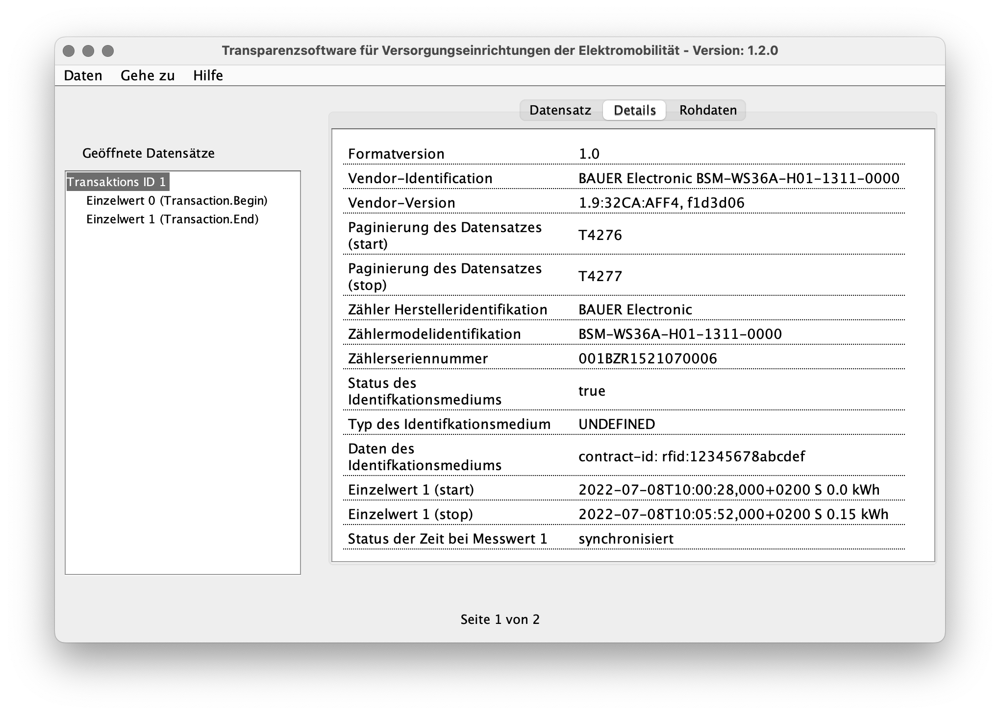

# Electric Vehicle Charging

The BSM-WS36A facilitates setting up electric vehicle charging applications in
three ways:

1. Taking and signing snapshots of data relevant for billing
2. Its ability to directly control an external contactor for controlling energy
   delivery and its controlled operation for recording snapshot data with the
   contactor turned off
3. Direct output of
   [OCMF](https://github.com/SAFE-eV/OCMF-Open-Charge-Metering-Format) data
   allowing end-user validation of billing data with commonly used and
   available software without the need for separate signing

The following sections demonstrate how to make use of them.


## Typical Setup

Core components of an electric vehicle charging application are the meter
itself and a contactor with appropriate auxiliary contacts for providing
feedback. [Hardware Setup](prerequisites.md#hardware-setup) shows the
single-phase setup we in the example below:


For charging electric cars, a three-phase installation is more common though.

If epoch time information is important for billing, an external controller is
required for providing it to the meter on a regular basis as described in
[Setting and Updating Time](time.md).


## Charging Scenario

### Overview

This example shows aspects of a typical charging scenario as sketched below:


The backend in this example generates OCMF-XML envelopes for billing data. But
every data format which implicitly or explicitly supports passing the actual
signed data could be generated from the snapshot data.


### Updating Time Information

The time information is assumed to be up to date. It could be set and updated
as described in [Setting and Updating Time](time.md). This needs to be done on
a regular basis.

shown below:
```
$ bsmtool set bsm/epoch=1609491600 bsm/tzo=60
```
```
--> 2a 10 9d44 0003 06 5feee490003c d4b0
<-- 2a 10 9d44 0003 e9aa
```


### Setting Identification Data

The BSM-WS36A provides three string [metadata points](snapshots.md#metadata)
_Meta1_, _Meta2_ and _Meta3_ which get recorded and signed when creating a
snapshot.

These three data points could be used according to the application's needs when
generating billing data from the regular snapshots. When using the meter's OCMF
representation, only _Meta1_ will be included as customer identification data
_ID_.

This example sets and uses the following demo data

- Customer identification data _contract-id: rfid:12345678abcdef_ set as _Meta1_
- The EVSE ID _evse-id: DE*BDO*E8025334492*2_ set as _Meta2_
- The charging station software version _csc-sw-version: v1.2.34_ as _Meta3_

where _12345678abcdef_ is meant to be the identification from a RFID
identification tag. This data could be set with the BSM Tool:
```
$ bsmtool set 'bsm/meta1=contract-id: rfid:12345678abcdef' 'bsm/meta2=evse-id: DE*BDO*E8025334492*2' 'bsm/meta3=csc-sw-version: v1.2.34'
```
```
--> 2a 10 9d57 0078 f0 636f6e74726163742d69643a20726669643a3132333435363738616263646566000000000000000000000000000000000000000000000000000000000000000000000000000000000000000000000000000000000000000000000000000000000000000000000000000000000000000000000000000000000000000000000000000000000000000000000000657673652d69643a2044452a42444f2a45383032353333343439322a320000000000000000000000000000000000000000000000000000000000000000000000000000000000000000000000000000000000000000000000000000000000000000000000 195c
<-- 2a 10 9d57 0078 584c
--> 2a 10 9dcf 0032 64 6373632d73772d76657273696f6e3a2076312e322e33340000000000000000000000000000000000000000000000000000000000000000000000000000000000000000000000000000000000000000000000000000000000000000000000000000000000 f0c8
<-- 2a 10 9dcf 0032 5854
```


### Start of Charging

Creating a _Signed Turn-On Snapshot_ starts the charging process by recording
the baseline data and turning on the contactor. [Snapshot
Creation](snapshots.md#snapshot-creation) gives the details about this
procedure.

This example uses the snapshot pair  _Signed Turn-On Snapshot_ and _Signed
Turn-Off Snapshot_ which switches an external contactor. Use the pair _Signed
Start Snapshot_ and _Signed End Snapshot_ in analog in case the meter does not
control an external contactor. See [Signed Snapshots](snapshots.md) for more
details.


#### Creating the _Signed Turn-On Snapshot_

Create and read the _Signed Turn-On Snapshot_ as follows:
```
$ bsmtool get-snapshot stons
bsm_snapshot:
    fixed:
        Typ: 1
        St: 0
        RCR: None
        TotWhImp: 52440 Wh
        W: 0.0 W
        MA1: 001BZR1521070006
        RCnt: 22978
        OS: 1867397 s
        Epoch: 1609491627 s
        TZO: 60 min
        EpochSetCnt: 2814
        EpochSetOS: 1867371 s
        DI: 1
        DO: 0
        Meta1: contract-id: rfid:12345678abcdef
        Meta2: evse-id: DE*BDO*E8025334492*2
        Meta3: csc-sw-version: v1.2.34
        Evt: 0
        NSig: 48
        BSig: 72
    repeating blocks blob:
        Sig: 3046022100abf6b2c50a4021f58d075e1df434dc96f1625df66142ec32c6ab831942631c3e022100f863e4aeccee44755302a38b4a08431835b645247b1db2cfecceaa7fe017cb4a
```
```
--> 2a 10 9f4a 0001 02 0002 ac03
<-- 2a 10 9f4a 0001 0810
--> 2a 03 9f49 0064 bdf8
<-- 2a 03 c8 00010000000000000000ccd8000000000001303031425a5231353231303730303036000059c2001c7e855feee4ab003c00000afe001c7e6b00010000636f6e74726163742d69643a20726669643a3132333435363738616263646566000000000000000000000000000000000000000000000000000000000000000000000000000000000000000000000000000000000000000000000000000000000000000000000000000000000000000000000000000000000000000000000000000000000000000000000000 3fae
--> 2a 03 9fad 007d 3c05
<-- 2a 03 fa 657673652d69643a2044452a42444f2a45383032353333343439322a3200000000000000000000000000000000000000000000000000000000000000000000000000000000000000000000000000000000000000000000000000000000000000000000006373632d73772d76657273696f6e3a2076312e322e3334000000000000000000000000000000000000000000000000000000000000000000000000000000000000000000000000000000000000000000000000000000000000000000000000000000000000000000003000483046022100abf6b2c50a4021f58d075e1df434dc96f1625df66142ec32c6ab831942631c3e022100f863 9652
--> 2a 03 a02a 001b 0012
<-- 2a 03 36 e4aeccee44755302a38b4a08431835b645247b1db2cfecceaa7fe017cb4a000000000000000000000000000000000000000000000000 23bd
```

#### Key Start Snapshot Data Points

Let's have a quick look at its key data points:

- Type and status
    - This is a [_Signed Turn-On
      Snapshot_](../../bauer_bsm/bsm/models/smdx_64901.xml#L6) as indicated by
      [_Typ_](../../bauer_bsm/bsm/models/smdx_64901.xml#L80)
    - It has been [created
      successfully](../../bauer_bsm/bsm/models/smdx_64901.xml#L12) according to
      its status [_St_](../../bauer_bsm/bsm/models/smdx_64901.xml#L131)
- Power and energy
    - The reference cumulative register
      [_RCR_](../../bauer_bsm/bsm/models/smdx_64901.xml#L185) which will show
      the energy consumption at the end has been reset to zero
    - [_TotWhImp_](../../bauer_bsm/bsm/models/smdx_64901.xml#L193) gives the
      total energy consumption tracked by this meter and could be used for
      computing the energy consumption of the actual charging process as the
      delta between start and end
    - It was taken with no active power
      ([_W_](../../bauer_bsm/bsm/models/smdx_64901.xml#L201) = 0 Wh) as it
      should be the case with the contactor turned off
- Time and counters
    - Let's remember the response counter
      [_RCnt_](../../bauer_bsm/bsm/models/smdx_64901.xml#L214) 22,978 for later
    - It has valid time information in _Epoch_ and _TZO_
- Metadata points _Meta1_ and _Meta2_ contain the previously set metadata


#### Start Snapshot Register Dump

The register dump (protocol addresses) of the start snapshot looks as follows:
```
$ bsmtool dump 40775 254
   40775: fd85 00fc 0001 0000 0000 0000 0000 ccd8  ................
   40783: 0000 0000 0001 3030 3142 5a52 3135 3231  ......001BZR1521
   40791: 3037 3030 3036 0000 59c2 001c 7e85 5fee  070006..Y...~._.
   40799: e4ab 003c 0000 0afe 001c 7e6b 0001 0000  ...<......~k....
   40807: 636f 6e74 7261 6374 2d69 643a 2072 6669  contract-id: rfi
   40815: 643a 3132 3334 3536 3738 6162 6364 6566  d:12345678abcdef
   40823: 0000 0000 0000 0000 0000 0000 0000 0000  ................
   40831: 0000 0000 0000 0000 0000 0000 0000 0000  ................
   40839: 0000 0000 0000 0000 0000 0000 0000 0000  ................
   40847: 0000 0000 0000 0000 0000 0000 0000 0000  ................
   40855: 0000 0000 0000 0000 0000 0000 0000 0000  ................
   40863: 0000 0000 0000 0000 0000 0000 0000 0000  ................
   40871: 0000 0000 0000 0000 0000 0000 6576 7365  ............evse
   40879: 2d69 643a 2044 452a 4244 4f2a 4538 3032  -id: DE*BDO*E802
   40887: 3533 3334 3439 322a 3200 0000 0000 0000  5334492*2.......
   40895: 0000 0000 0000 0000 0000 0000 0000 0000  ................
   40903: 0000 0000 0000 0000 0000 0000 0000 0000  ................
   40911: 0000 0000 0000 0000 0000 0000 0000 0000  ................
   40919: 0000 0000 0000 0000 0000 0000 0000 0000  ................
   40927: 6373 632d 7377 2d76 6572 7369 6f6e 3a20  csc-sw-version: 
   40935: 7631 2e32 2e33 3400 0000 0000 0000 0000  v1.2.34.........
   40943: 0000 0000 0000 0000 0000 0000 0000 0000  ................
   40951: 0000 0000 0000 0000 0000 0000 0000 0000  ................
   40959: 0000 0000 0000 0000 0000 0000 0000 0000  ................
   40967: 0000 0000 0000 0000 0000 0000 0000 0000  ................
   40975: 0000 0000 0000 0000 0030 0048 3046 0221  .........0.H0F.!
   40983: 00ab f6b2 c50a 4021 f58d 075e 1df4 34dc  ......@!...^..4.
   40991: 96f1 625d f661 42ec 32c6 ab83 1942 631c  ..b].aB.2....Bc.
   40999: 3e02 2100 f863 e4ae ccee 4475 5302 a38b  >.!..c....DuS...
   41007: 4a08 4318 35b6 4524 7b1d b2cf ecce aa7f  J.C.5.E${.......
   41015: e017 cb4a 0000 0000 0000 0000 0000 0000  ...J............
   41023: 0000 0000 0000 0000 0000 0000            ............
```


#### Start OCMF Representation

The snapshot is valid and so its OCMF representation could be read from _OCMF
Signed Turn-On Snapshot_ with the BSM Tool:
```
$ bsmtool get ostons
bsm_ocmf:
    Typ: 1
    St: 0
    O: OCMF|{"FV":"1.0","GI":"BAUER Electronic BSM-WS36A-H01-1311-0000","GS":"001BZR1521070006","GV":"1.9:32CA:AFF4, 6d1dd3c","PG":"T22978","MV":"BAUER Electronic","MM":"BSM-WS36A-H01-1311-0000","MS":"001BZR1521070006","IS":true,"IT":"UNDEFINED","ID":"contract-id: rfid:12345678abcdef","RD":[{"TM":"2021-01-01T10:00:27,000+0100 S","TX":"B","RV":0,"RI":"1-0:1.8.0*198","RU":"Wh","XV":52440,"XI":"1-0:1.8.0*255","XU":"Wh","XT":1,"RT":"AC","EF":"","ST":"G"}]}|{"SA":"ECDSA-secp256r1-SHA256","SD":"3046022100a7d908412339abdc7b56bc8f0b604b4241d5cde85123adca07cc2ae57bd6fbb502210087064193143aee0b7ad117bb3fe2b8c2c19dcd261f84a528867f69755370ea9a"}
```
```
--> 2a 03 a535 0002 f0d2
<-- 2a 03 04 00010000 30f1
--> 2a 03 a537 007d 10f2
<-- 2a 03 fa 4f434d467c7b224656223a22312e30222c224749223a22424155455220456c656374726f6e69632042534d2d57533336412d4830312d313331312d30303030222c224753223a22303031425a5231353231303730303036222c224756223a22312e393a333243413a414646342c2036643164643363222c225047223a22543232393738222c224d56223a22424155455220456c656374726f6e6963222c224d4d223a2242534d2d57533336412d4830312d313331312d30303030222c224d53223a22303031425a5231353231303730303036222c224953223a747275652c224954223a22554e444546494e4544222c224944223a22636f6e7472 1d4b
--> 2a 03 a5b4 007d e11a
<-- 2a 03 fa 6163742d69643a20726669643a3132333435363738616263646566222c225244223a5b7b22544d223a22323032312d30312d30315431303a30303a32372c3030302b303130302053222c225458223a2242222c225256223a302c225249223a22312d303a312e382e302a313938222c225255223a225768222c225856223a35323434302c225849223a22312d303a312e382e302a323535222c225855223a225768222c225854223a312c225254223a224143222c224546223a22222c225354223a2247227d5d7d7c7b225341223a2245434453412d7365637032353672312d534841323536222c225344223a2233303436303232313030613764 e1b4
--> 2a 03 a631 007d f0b7
<-- 2a 03 fa 3930383431323333396162646337623536626338663062363034623432343164356364653835313233616463613037636332616535376264366662623530323231303038373036343139333134336165653062376164313137626233666532623863326331396463643236316638346135323838363766363937353533373065613961227d000000000000000000000000000000000000000000000000000000000000000000000000000000000000000000000000000000000000000000000000000000000000000000000000000000000000000000000000000000000000000000000000000000000000000000000000000000000000000000 c86b
--> 2a 03 a6ae 0079 c15a
<-- 2a 03 f2 0000000000000000000000000000000000000000000000000000000000000000000000000000000000000000000000000000000000000000000000000000000000000000000000000000000000000000000000000000000000000000000000000000000000000000000000000000000000000000000000000000000000000000000000000000000000000000000000000000000000000000000000000000000000000000000000000000000000000000000000000000000000000000000000000000000000000000000000000000000000000000000000000000000000000000000000000000000000000000000000000000 443c
```


#### Key Start OCMF Values

[Pretty-printed](ocmf.md#ocmf-json-payload), the _OCMF Signed Turn-On
Snapshot_'s payload looks like:
```json
$ bsmtool get ostons/o | cut -d \| -f 2 | jq .
{
  "FV": "1.0",
  "GI": "BAUER Electronic BSM-WS36A-H01-1311-0000",
  "GS": "001BZR1521070006",
  "GV": "1.9:32CA:AFF4, 6d1dd3c",
  "PG": "T22978",
  "MV": "BAUER Electronic",
  "MM": "BSM-WS36A-H01-1311-0000",
  "MS": "001BZR1521070006",
  "IS": true,
  "IT": "UNDEFINED",
  "ID": "contract-id: rfid:12345678abcdef",
  "RD": [
    {
      "TM": "2021-01-01T10:00:27,000+0100 S",
      "TX": "B",
      "RV": 0,
      "RI": "1-0:1.8.0*198",
      "RU": "Wh",
      "XV": 52440,
      "XI": "1-0:1.8.0*255",
      "XU": "Wh",
      "XT": 1,
      "RT": "AC",
      "EF": "",
      "ST": "G"
    }
  ]
}
```

Let's have a quick look at its key data points too:

- Type and status
    - Its type is indicated by the transaction _TX_ = _B_ (for beginning)
    - Its status _ST_ indicates that it is _good_ = _G_
- Power and energy
    - The reference cumulative register is used as the primary reading value
      _RV_
    - The total energy consumption is given as the additional value _XV_
    - The OCMF data does not contain the active power
- Time and counters
    - It provides the response counter as the snapshot in _PG_ (for pagination)
      prefixed with _T_ for a reading in a transactional context
    - Epoch time information is given in ISO 8601 format instead of epoch
      seconds and timezone offset
- _Meta1_ is used as identification data _ID_ and the identification type
  always _IT_ always returns _UNDEFINED_


#### Start OCMF Register Dump

The register dump of the start snapshot's OCMF representation looks as follows:
```
$ bsmtool dump 42291 500
   42291: fd87 01f2 0001 0000 4f43 4d46 7c7b 2246  ........OCMF|{"F
   42299: 5622 3a22 312e 3022 2c22 4749 223a 2242  V":"1.0","GI":"B
   42307: 4155 4552 2045 6c65 6374 726f 6e69 6320  AUER Electronic 
   42315: 4253 4d2d 5753 3336 412d 4830 312d 3133  BSM-WS36A-H01-13
   42323: 3131 2d30 3030 3022 2c22 4753 223a 2230  11-0000","GS":"0
   42331: 3031 425a 5231 3532 3130 3730 3030 3622  01BZR1521070006"
   42339: 2c22 4756 223a 2231 2e39 3a33 3243 413a  ,"GV":"1.9:32CA:
   42347: 4146 4634 2c20 3664 3164 6433 6322 2c22  AFF4, 6d1dd3c","
   42355: 5047 223a 2254 3232 3937 3822 2c22 4d56  PG":"T22978","MV
   42363: 223a 2242 4155 4552 2045 6c65 6374 726f  ":"BAUER Electro
   42371: 6e69 6322 2c22 4d4d 223a 2242 534d 2d57  nic","MM":"BSM-W
   42379: 5333 3641 2d48 3031 2d31 3331 312d 3030  S36A-H01-1311-00
   42387: 3030 222c 224d 5322 3a22 3030 3142 5a52  00","MS":"001BZR
   42395: 3135 3231 3037 3030 3036 222c 2249 5322  1521070006","IS"
   42403: 3a74 7275 652c 2249 5422 3a22 554e 4445  :true,"IT":"UNDE
   42411: 4649 4e45 4422 2c22 4944 223a 2263 6f6e  FINED","ID":"con
   42419: 7472 6163 742d 6964 3a20 7266 6964 3a31  tract-id: rfid:1
   42427: 3233 3435 3637 3861 6263 6465 6622 2c22  2345678abcdef","
   42435: 5244 223a 5b7b 2254 4d22 3a22 3230 3231  RD":[{"TM":"2021
   42443: 2d30 312d 3031 5431 303a 3030 3a32 372c  -01-01T10:00:27,
   42451: 3030 302b 3031 3030 2053 222c 2254 5822  000+0100 S","TX"
   42459: 3a22 4222 2c22 5256 223a 302c 2252 4922  :"B","RV":0,"RI"
   42467: 3a22 312d 303a 312e 382e 302a 3139 3822  :"1-0:1.8.0*198"
   42475: 2c22 5255 223a 2257 6822 2c22 5856 223a  ,"RU":"Wh","XV":
   42483: 3532 3434 302c 2258 4922 3a22 312d 303a  52440,"XI":"1-0:
   42491: 312e 382e 302a 3235 3522 2c22 5855 223a  1.8.0*255","XU":
   42499: 2257 6822 2c22 5854 223a 312c 2252 5422  "Wh","XT":1,"RT"
   42507: 3a22 4143 222c 2245 4622 3a22 222c 2253  :"AC","EF":"","S
   42515: 5422 3a22 4722 7d5d 7d7c 7b22 5341 223a  T":"G"}]}|{"SA":
   42523: 2245 4344 5341 2d73 6563 7032 3536 7231  "ECDSA-secp256r1
   42531: 2d53 4841 3235 3622 2c22 5344 223a 2233  -SHA256","SD":"3
   42539: 3034 3630 3232 3130 3061 3764 3930 3834  046022100a7d9084
   42547: 3132 3333 3961 6264 6337 6235 3662 6338  12339abdc7b56bc8
   42555: 6630 6236 3034 6234 3234 3164 3563 6465  f0b604b4241d5cde
   42563: 3835 3132 3361 6463 6130 3763 6332 6165  85123adca07cc2ae
   42571: 3537 6264 3666 6262 3530 3232 3130 3038  57bd6fbb50221008
   42579: 3730 3634 3139 3331 3433 6165 6530 6237  7064193143aee0b7
   42587: 6164 3131 3762 6233 6665 3262 3863 3263  ad117bb3fe2b8c2c
   42595: 3139 6463 6432 3631 6638 3461 3532 3838  19dcd261f84a5288
   42603: 3637 6636 3937 3535 3337 3065 6139 6122  67f69755370ea9a"
   42611: 7d00 0000 0000 0000 0000 0000 0000 0000  }...............
   42619: 0000 0000 0000 0000 0000 0000 0000 0000  ................
   42627: 0000 0000 0000 0000 0000 0000 0000 0000  ................
   42635: 0000 0000 0000 0000 0000 0000 0000 0000  ................
   42643: 0000 0000 0000 0000 0000 0000 0000 0000  ................
   42651: 0000 0000 0000 0000 0000 0000 0000 0000  ................
   42659: 0000 0000 0000 0000 0000 0000 0000 0000  ................
   42667: 0000 0000 0000 0000 0000 0000 0000 0000  ................
   42675: 0000 0000 0000 0000 0000 0000 0000 0000  ................
   42683: 0000 0000 0000 0000 0000 0000 0000 0000  ................
   42691: 0000 0000 0000 0000 0000 0000 0000 0000  ................
   42699: 0000 0000 0000 0000 0000 0000 0000 0000  ................
   42707: 0000 0000 0000 0000 0000 0000 0000 0000  ................
   42715: 0000 0000 0000 0000 0000 0000 0000 0000  ................
   42723: 0000 0000 0000 0000 0000 0000 0000 0000  ................
   42731: 0000 0000 0000 0000 0000 0000 0000 0000  ................
   42739: 0000 0000 0000 0000 0000 0000 0000 0000  ................
   42747: 0000 0000 0000 0000 0000 0000 0000 0000  ................
   42755: 0000 0000 0000 0000 0000 0000 0000 0000  ................
   42763: 0000 0000 0000 0000 0000 0000 0000 0000  ................
   42771: 0000 0000 0000 0000 0000 0000 0000 0000  ................
   42779: 0000 0000 0000 0000 0000 0000 0000 0000  ................
   42787: 0000 0000 0000 0000                      ........
```


### Intermediate Values

Intermediate values for the current charging process might be required for
example for displaying status information. There are two ways to get them:

- Just reading out the desired data points from the [AC
  Meter](modbus-interface.md#model-instances) and [_Signing
  Meter_](modbus-interface.md#model-instances) model instances

- Creating [_Signed Current Snapshot_](modbus-interface.md#model-instances)s

Both of them provide data suitable for status updates. The latter associates
energy consumption with a timestamp but increases the response counter so that
this one will reflect the number of intermediate snapshots taken at the end of
the charging process.


### End of Charging

Creating a _Signed Turn-Off Snapshot_ ends the charging process by turning of
the contactor and recoding the snapshot data. Again, [Snapshot Creation](snapshots.md#snapshot-creation) gives
the details about this procedure.


#### Creating the Signed Turn-Off Snapshot

Creating and reading the _Signed Turn-Off Snapshot_ works in analog to
[creating the _Signed Turn-On Snapshot_](#creating-the-signed-turn-on-snapshot)
and as follows:
```
$ bsmtool get-snapshot stoffs
bsm_snapshot:
    fixed:
        Typ: 2
        St: 0
        RCR: 160 Wh
        TotWhImp: 52610 Wh
        W: 0.0 W
        MA1: 001BZR1521070006
        RCnt: 22979
        OS: 1867722 s
        Epoch: 1609491952 s
        TZO: 60 min
        EpochSetCnt: 2814
        EpochSetOS: 1867371 s
        DI: 1
        DO: 0
        Meta1: contract-id: rfid:12345678abcdef
        Meta2: evse-id: DE*BDO*E8025334492*2
        Meta3: csc-sw-version: v1.2.34
        Evt: 0
        NSig: 48
        BSig: 70
    repeating blocks blob:
        Sig: 3044022062f36e0583471d4f438da9da549be550cdbdfa4f9d77f3d4c53339f18c66850a02200e997ccb47cb33b1fb6c504b081b097cb65231b041c9f882122cc8298f575501
```
```
--> 2a 10 a048 0001 02 0002 62e2
<-- 2a 10 a048 0001 a5c4
--> 2a 03 a047 0064 d02f
<-- 2a 03 c8 00020000000000a00000cd82000000000001303031425a5231353231303730303036000059c3001c7fca5feee5f0003c00000afe001c7e6b00010000636f6e74726163742d69643a20726669643a3132333435363738616263646566000000000000000000000000000000000000000000000000000000000000000000000000000000000000000000000000000000000000000000000000000000000000000000000000000000000000000000000000000000000000000000000000000000000000000000000000 7eb9
--> 2a 03 a0ab 007d d010
<-- 2a 03 fa 657673652d69643a2044452a42444f2a45383032353333343439322a3200000000000000000000000000000000000000000000000000000000000000000000000000000000000000000000000000000000000000000000000000000000000000000000006373632d73772d76657273696f6e3a2076312e322e3334000000000000000000000000000000000000000000000000000000000000000000000000000000000000000000000000000000000000000000000000000000000000000000000000000000000000000000003000463044022062f36e0583471d4f438da9da549be550cdbdfa4f9d77f3d4c53339f18c66850a02200e997ccb 3f14
--> 2a 03 a128 001b a02e
<-- 2a 03 36 47cb33b1fb6c504b081b097cb65231b041c9f882122cc8298f5755010000000000000000000000000000000000000000000000000000 be63
```


#### Key End Snapshot Data Points

Let's look one more time at the snapshot's key data points and compare them to
the _Signed Turn-On Snapshot_ taken at the start of charging:

- Type and status
    - This is a [_Signed Turn-Off
      Snapshot_](../../bauer_bsm/bsm/models/smdx_64901.xml#L7) as indicated by
      [_Typ_](../../bauer_bsm/bsm/models/smdx_64901.xml#L80)
    - It has been [created
      successfully](../../bauer_bsm/bsm/models/smdx_64901.xml#L12) according to
      its status [_St_](../../bauer_bsm/bsm/models/smdx_64901.xml#L131)
- Power and energy
    - The reference cumulative register
      [_RCR_](../../bauer_bsm/bsm/models/smdx_64901.xml#L185) started at zero
      and now shows the energy delivered during this charging process: 150 Wh
    - The total energy delivered,
      [_TotWhImp_](../../bauer_bsm/bsm/models/smdx_64901.xml#L193), increased
      from 88,200 Wh to 88,350 Wh which gives a consumption of 150 Wh. Due to
      the [internal state of _TotWhImp_](snapshots.md#energy-and-power) this
      difference can be one least significant digit larger than the value for
      _RCR_ (shown in the display).
    - Again, there is no active power
      ([_W_](../../bauer_bsm/bsm/models/smdx_64901.xml#L201) = 0 Wh) since
      power delivery got cut before recording the snapshot data
- Time and counters
    - The response counter
      [_RCnt_](../../bauer_bsm/bsm/models/smdx_64901.xml#L214) is 22,979 - one
    - It has valid time information in _Epoch_ and _TZO_
    - [_EpochSetCnt_](../../bauer_bsm/bsm/models/smdx_64901.xml#L241) (with a
      value of 2,814) and
      [_EpochSetOS_](../../bauer_bsm/bsm/models/smdx_64901.xml#L246) (with a
      value of 1,867,371) are the same as in the start snapshot. So they are
      using the same time base originating from this same setting of time.
- Metadata is still the same as in _Signed Turn-On Snapshot_


#### End Snapshot Register Dump

The register dump of the end snapshot looks as follows
```
$ bsmtool dump 41029 254
   41029: fd85 00fc 0002 0000 0000 00a0 0000 cd82  ................
   41037: 0000 0000 0001 3030 3142 5a52 3135 3231  ......001BZR1521
   41045: 3037 3030 3036 0000 59c3 001c 7fca 5fee  070006..Y....._.
   41053: e5f0 003c 0000 0afe 001c 7e6b 0001 0000  ...<......~k....
   41061: 636f 6e74 7261 6374 2d69 643a 2072 6669  contract-id: rfi
   41069: 643a 3132 3334 3536 3738 6162 6364 6566  d:12345678abcdef
   41077: 0000 0000 0000 0000 0000 0000 0000 0000  ................
   41085: 0000 0000 0000 0000 0000 0000 0000 0000  ................
   41093: 0000 0000 0000 0000 0000 0000 0000 0000  ................
   41101: 0000 0000 0000 0000 0000 0000 0000 0000  ................
   41109: 0000 0000 0000 0000 0000 0000 0000 0000  ................
   41117: 0000 0000 0000 0000 0000 0000 0000 0000  ................
   41125: 0000 0000 0000 0000 0000 0000 6576 7365  ............evse
   41133: 2d69 643a 2044 452a 4244 4f2a 4538 3032  -id: DE*BDO*E802
   41141: 3533 3334 3439 322a 3200 0000 0000 0000  5334492*2.......
   41149: 0000 0000 0000 0000 0000 0000 0000 0000  ................
   41157: 0000 0000 0000 0000 0000 0000 0000 0000  ................
   41165: 0000 0000 0000 0000 0000 0000 0000 0000  ................
   41173: 0000 0000 0000 0000 0000 0000 0000 0000  ................
   41181: 6373 632d 7377 2d76 6572 7369 6f6e 3a20  csc-sw-version: 
   41189: 7631 2e32 2e33 3400 0000 0000 0000 0000  v1.2.34.........
   41197: 0000 0000 0000 0000 0000 0000 0000 0000  ................
   41205: 0000 0000 0000 0000 0000 0000 0000 0000  ................
   41213: 0000 0000 0000 0000 0000 0000 0000 0000  ................
   41221: 0000 0000 0000 0000 0000 0000 0000 0000  ................
   41229: 0000 0000 0000 0000 0030 0046 3044 0220  .........0.F0D. 
   41237: 62f3 6e05 8347 1d4f 438d a9da 549b e550  b.n..G.OC...T..P
   41245: cdbd fa4f 9d77 f3d4 c533 39f1 8c66 850a  ...O.w...39..f..
   41253: 0220 0e99 7ccb 47cb 33b1 fb6c 504b 081b  . ..|.G.3..lPK..
   41261: 097c b652 31b0 41c9 f882 122c c829 8f57  .|.R1.A....,.).W
   41269: 5501 0000 0000 0000 0000 0000 0000 0000  U...............
   41277: 0000 0000 0000 0000 0000 0000            ............
```


#### OCMF End Representation

After successfully creating the _Signed Turn-Off Snapshot_, its OCMF
representation can be read from _OCMF Signed Turn-Off Snapshot_:
```
$ bsmtool get ostoffs
bsm_ocmf:
    Typ: 2
    St: 0
    O: OCMF|{"FV":"1.0","GI":"BAUER Electronic BSM-WS36A-H01-1311-0000","GS":"001BZR1521070006","GV":"1.9:32CA:AFF4, 6d1dd3c","PG":"T22979","MV":"BAUER Electronic","MM":"BSM-WS36A-H01-1311-0000","MS":"001BZR1521070006","IS":true,"IT":"UNDEFINED","ID":"contract-id: rfid:12345678abcdef","RD":[{"TM":"2021-01-01T10:05:52,000+0100 S","TX":"E","RV":160,"RI":"1-0:1.8.0*198","RU":"Wh","XV":52610,"XI":"1-0:1.8.0*255","XU":"Wh","XT":2,"RT":"AC","EF":"","ST":"G"}]}|{"SA":"ECDSA-secp256r1-SHA256","SD":"304502207f70363859e48dc22e886258065a684b6de02bff75ce916faaf04d440d163e5b022100a23774b07de5e7fd40448f141f48b8ff6bf3c3fd68ad9fc64595f29f31ecbd4f"}
```
```
--> 2a 03 a729 0002 30ac
<-- 2a 03 04 00020000 c0f1
--> 2a 03 a72b 007d d08c
<-- 2a 03 fa 4f434d467c7b224656223a22312e30222c224749223a22424155455220456c656374726f6e69632042534d2d57533336412d4830312d313331312d30303030222c224753223a22303031425a5231353231303730303036222c224756223a22312e393a333243413a414646342c2036643164643363222c225047223a22543232393739222c224d56223a22424155455220456c656374726f6e6963222c224d4d223a2242534d2d57533336412d4830312d313331312d30303030222c224d53223a22303031425a5231353231303730303036222c224953223a747275652c224954223a22554e444546494e4544222c224944223a22636f6e7472 dc47
--> 2a 03 a7a8 007d 2164
<-- 2a 03 fa 6163742d69643a20726669643a3132333435363738616263646566222c225244223a5b7b22544d223a22323032312d30312d30315431303a30353a35322c3030302b303130302053222c225458223a2245222c225256223a3136302c225249223a22312d303a312e382e302a313938222c225255223a225768222c225856223a35323631302c225849223a22312d303a312e382e302a323535222c225855223a225768222c225854223a322c225254223a224143222c224546223a22222c225354223a2247227d5d7d7c7b225341223a2245434453412d7365637032353672312d534841323536222c225344223a223330343530323230376637 ce4c
--> 2a 03 a825 007d b25b
<-- 2a 03 fa 3033363338353965343864633232653838363235383036356136383462366465303262666637356365393136666161663034643434306431363365356230323231303061323337373462303764653565376664343034343866313431663438623866663662663363336664363861643966633634353935663239663331656362643466227d000000000000000000000000000000000000000000000000000000000000000000000000000000000000000000000000000000000000000000000000000000000000000000000000000000000000000000000000000000000000000000000000000000000000000000000000000000000000000000 0837
--> 2a 03 a8a2 0079 03b1
<-- 2a 03 f2 0000000000000000000000000000000000000000000000000000000000000000000000000000000000000000000000000000000000000000000000000000000000000000000000000000000000000000000000000000000000000000000000000000000000000000000000000000000000000000000000000000000000000000000000000000000000000000000000000000000000000000000000000000000000000000000000000000000000000000000000000000000000000000000000000000000000000000000000000000000000000000000000000000000000000000000000000000000000000000000000000000 443c
```


#### Key End OCMF Values

[Pretty-printed](ocmf.md#ocmf-json-payload), the _OCMF Signed Turn-Off
Snapshot_ looks as follows:
```json
$ bsmtool get ostons/o | cut -d \| -f 2 | jq .
{
  "FV": "1.0",
  "GI": "BAUER Electronic BSM-WS36A-H01-1311-0000",
  "GS": "001BZR1521070006",
  "GV": "1.9:32CA:AFF4, 6d1dd3c",
  "PG": "T22979",
  "MV": "BAUER Electronic",
  "MM": "BSM-WS36A-H01-1311-0000",
  "MS": "001BZR1521070006",
  "IS": true,
  "IT": "UNDEFINED",
  "ID": "contract-id: rfid:12345678abcdef",
  "RD": [
    {
      "TM": "2021-01-01T10:05:52,000+0100 S",
      "TX": "E",
      "RV": 160,
      "RI": "1-0:1.8.0*198",
      "RU": "Wh",
      "XV": 52610,
      "XI": "1-0:1.8.0*255",
      "XU": "Wh",
      "XT": 2,
      "RT": "AC",
      "EF": "",
      "ST": "G"
    }
  ]
}
```

Let's have a quick look at its key data points:

- Type and status
    - Its type is indicated by the transaction _TX_ = _E_ (for end)
    - Its status _ST_ = _G_ stands for good
- Power and energy
    - The primary reading value _RV_ now shows the energy consumption from the
      refernce cumulative register: 160 Wh
    - The total energy consumption is given by _XV_
    - The OCMF data does not contain the active power
- Time and counters
    - The response counter _PG_ (prefixed with _T_) gives the value 22,979 and
      is the successor of the start response counter
    - Epoch time information is given in ISO 8601 format
- The identification data _ID_ taken from _Meta1_ has the same value as in the
  start OCMF data


#### End OCMF Register Dump

The register dump of the end snapshot's OCMF representation looks as follows:
```
$ bsmtool dump 42791 500
   42791: fd87 01f2 0002 0000 4f43 4d46 7c7b 2246  ........OCMF|{"F
   42799: 5622 3a22 312e 3022 2c22 4749 223a 2242  V":"1.0","GI":"B
   42807: 4155 4552 2045 6c65 6374 726f 6e69 6320  AUER Electronic 
   42815: 4253 4d2d 5753 3336 412d 4830 312d 3133  BSM-WS36A-H01-13
   42823: 3131 2d30 3030 3022 2c22 4753 223a 2230  11-0000","GS":"0
   42831: 3031 425a 5231 3532 3130 3730 3030 3622  01BZR1521070006"
   42839: 2c22 4756 223a 2231 2e39 3a33 3243 413a  ,"GV":"1.9:32CA:
   42847: 4146 4634 2c20 3664 3164 6433 6322 2c22  AFF4, 6d1dd3c","
   42855: 5047 223a 2254 3232 3937 3922 2c22 4d56  PG":"T22979","MV
   42863: 223a 2242 4155 4552 2045 6c65 6374 726f  ":"BAUER Electro
   42871: 6e69 6322 2c22 4d4d 223a 2242 534d 2d57  nic","MM":"BSM-W
   42879: 5333 3641 2d48 3031 2d31 3331 312d 3030  S36A-H01-1311-00
   42887: 3030 222c 224d 5322 3a22 3030 3142 5a52  00","MS":"001BZR
   42895: 3135 3231 3037 3030 3036 222c 2249 5322  1521070006","IS"
   42903: 3a74 7275 652c 2249 5422 3a22 554e 4445  :true,"IT":"UNDE
   42911: 4649 4e45 4422 2c22 4944 223a 2263 6f6e  FINED","ID":"con
   42919: 7472 6163 742d 6964 3a20 7266 6964 3a31  tract-id: rfid:1
   42927: 3233 3435 3637 3861 6263 6465 6622 2c22  2345678abcdef","
   42935: 5244 223a 5b7b 2254 4d22 3a22 3230 3231  RD":[{"TM":"2021
   42943: 2d30 312d 3031 5431 303a 3035 3a35 322c  -01-01T10:05:52,
   42951: 3030 302b 3031 3030 2053 222c 2254 5822  000+0100 S","TX"
   42959: 3a22 4522 2c22 5256 223a 3136 302c 2252  :"E","RV":160,"R
   42967: 4922 3a22 312d 303a 312e 382e 302a 3139  I":"1-0:1.8.0*19
   42975: 3822 2c22 5255 223a 2257 6822 2c22 5856  8","RU":"Wh","XV
   42983: 223a 3532 3631 302c 2258 4922 3a22 312d  ":52610,"XI":"1-
   42991: 303a 312e 382e 302a 3235 3522 2c22 5855  0:1.8.0*255","XU
   42999: 223a 2257 6822 2c22 5854 223a 322c 2252  ":"Wh","XT":2,"R
   43007: 5422 3a22 4143 222c 2245 4622 3a22 222c  T":"AC","EF":"",
   43015: 2253 5422 3a22 4722 7d5d 7d7c 7b22 5341  "ST":"G"}]}|{"SA
   43023: 223a 2245 4344 5341 2d73 6563 7032 3536  ":"ECDSA-secp256
   43031: 7231 2d53 4841 3235 3622 2c22 5344 223a  r1-SHA256","SD":
   43039: 2233 3034 3530 3232 3037 6637 3033 3633  "304502207f70363
   43047: 3835 3965 3438 6463 3232 6538 3836 3235  859e48dc22e88625
   43055: 3830 3635 6136 3834 6236 6465 3032 6266  8065a684b6de02bf
   43063: 6637 3563 6539 3136 6661 6166 3034 6434  f75ce916faaf04d4
   43071: 3430 6431 3633 6535 6230 3232 3130 3061  40d163e5b022100a
   43079: 3233 3737 3462 3037 6465 3565 3766 6434  23774b07de5e7fd4
   43087: 3034 3438 6631 3431 6634 3862 3866 6636  0448f141f48b8ff6
   43095: 6266 3363 3366 6436 3861 6439 6663 3634  bf3c3fd68ad9fc64
   43103: 3539 3566 3239 6633 3165 6362 6434 6622  595f29f31ecbd4f"
   43111: 7d00 0000 0000 0000 0000 0000 0000 0000  }...............
   43119: 0000 0000 0000 0000 0000 0000 0000 0000  ................
   43127: 0000 0000 0000 0000 0000 0000 0000 0000  ................
   43135: 0000 0000 0000 0000 0000 0000 0000 0000  ................
   43143: 0000 0000 0000 0000 0000 0000 0000 0000  ................
   43151: 0000 0000 0000 0000 0000 0000 0000 0000  ................
   43159: 0000 0000 0000 0000 0000 0000 0000 0000  ................
   43167: 0000 0000 0000 0000 0000 0000 0000 0000  ................
   43175: 0000 0000 0000 0000 0000 0000 0000 0000  ................
   43183: 0000 0000 0000 0000 0000 0000 0000 0000  ................
   43191: 0000 0000 0000 0000 0000 0000 0000 0000  ................
   43199: 0000 0000 0000 0000 0000 0000 0000 0000  ................
   43207: 0000 0000 0000 0000 0000 0000 0000 0000  ................
   43215: 0000 0000 0000 0000 0000 0000 0000 0000  ................
   43223: 0000 0000 0000 0000 0000 0000 0000 0000  ................
   43231: 0000 0000 0000 0000 0000 0000 0000 0000  ................
   43239: 0000 0000 0000 0000 0000 0000 0000 0000  ................
   43247: 0000 0000 0000 0000 0000 0000 0000 0000  ................
   43255: 0000 0000 0000 0000 0000 0000 0000 0000  ................
   43263: 0000 0000 0000 0000 0000 0000 0000 0000  ................
   43271: 0000 0000 0000 0000 0000 0000 0000 0000  ................
   43279: 0000 0000 0000 0000 0000 0000 0000 0000  ................
   43287: 0000 0000 0000 0000                      ........
```


### Billing Data and Verification

Having _Signed Turn-On Snapshot_ and _Signed Turn-Off Snapshot_ successfully
created and read, billing data could be generated. Depending on the application
it might be either derived from the snapshot data or its OCMF representation.
In the latter case this data is typically wrapped in an OCMF XML envelope as
described in [OCMF XML](ocmf.md#ocmf-xml).

[Snapshot Verification](snapshots.md#snapshot-verification) describes how to
verify snapshot data and [OCMF XML](ocmf.md#ocmf-xml) the generation and
verification of OCMF XML envelopes.


#### Chargy

Chargy verifies JSON data generated by chargeIT mobility's backend. [chargeIT
mobility Chargy and Custom Formats](chargy.md) describes this format.

After downloading or just copying the data from the portal, it can be opened in
or pasted into Chargy for verification. For example, the data set
[`ev-charging-chargy.json`](data/ev-charging-chargy.json):


#### OCMF with S.A.F.E. Transparenzsoftware

For this example, the OCMF XML envelope could be generated from the OCMF
representation of start and end snapshot created above with:
```xml
$ bsmtool ocmf-xml ostons ostoffs | tee ev-charging-ocmf.xml
<?xml version="1.0" encoding="ISO-8859-1" standalone="yes"?>
<values>
  <value transactionId="1" context="Transaction.Begin">
    <signedData format="OCMF" encoding="plain">OCMF|{"FV":"1.0","GI":"BAUER Electronic BSM-WS36A-H01-1311-0000","GS":"001BZR1521070006","GV":"1.9:32CA:AFF4, 6d1dd3c","PG":"T22978","MV":"BAUER Electronic","MM":"BSM-WS36A-H01-1311-0000","MS":"001BZR1521070006","IS":true,"IT":"UNDEFINED","ID":"contract-id: rfid:12345678abcdef","RD":[{"TM":"2021-01-01T10:00:27,000+0100 S","TX":"B","RV":0,"RI":"1-0:1.8.0*198","RU":"Wh","XV":52440,"XI":"1-0:1.8.0*255","XU":"Wh","XT":1,"RT":"AC","EF":"","ST":"G"}]}|{"SA":"ECDSA-secp256r1-SHA256","SD":"3046022100a7d908412339abdc7b56bc8f0b604b4241d5cde85123adca07cc2ae57bd6fbb502210087064193143aee0b7ad117bb3fe2b8c2c19dcd261f84a528867f69755370ea9a"}</signedData>
    <publicKey encoding="plain">3059301306072a8648ce3d020106082a8648ce3d030107034200044bfd02c1d85272ceea9977db26d72cc401d9e5602faeee7ec7b6b62f9c0cce34ad8d345d5ac0e8f65deb5ff0bb402b1b87926bd1b7fc2dbc3a9774e8e70c7254</publicKey>
  </value>
  <value transactionId="1" context="Transaction.End">
    <signedData format="OCMF" encoding="plain">OCMF|{"FV":"1.0","GI":"BAUER Electronic BSM-WS36A-H01-1311-0000","GS":"001BZR1521070006","GV":"1.9:32CA:AFF4, 6d1dd3c","PG":"T22979","MV":"BAUER Electronic","MM":"BSM-WS36A-H01-1311-0000","MS":"001BZR1521070006","IS":true,"IT":"UNDEFINED","ID":"contract-id: rfid:12345678abcdef","RD":[{"TM":"2021-01-01T10:05:52,000+0100 S","TX":"E","RV":160,"RI":"1-0:1.8.0*198","RU":"Wh","XV":52610,"XI":"1-0:1.8.0*255","XU":"Wh","XT":2,"RT":"AC","EF":"","ST":"G"}]}|{"SA":"ECDSA-secp256r1-SHA256","SD":"304502207f70363859e48dc22e886258065a684b6de02bff75ce916faaf04d440d163e5b022100a23774b07de5e7fd40448f141f48b8ff6bf3c3fd68ad9fc64595f29f31ecbd4f"}</signedData>
    <publicKey encoding="plain">3059301306072a8648ce3d020106082a8648ce3d030107034200044bfd02c1d85272ceea9977db26d72cc401d9e5602faeee7ec7b6b62f9c0cce34ad8d345d5ac0e8f65deb5ff0bb402b1b87926bd1b7fc2dbc3a9774e8e70c7254</publicKey>
  </value>
</values>
```

This data (saved as [`ev-charging-ocmf.xml`](data/ev-charging-ocmf.xml)) can be
successfully verified with [S.A.F.E. e.V.
Transparenzsoftware](https://www.safe-ev.de/de/transparenzsoftware.php) by
loading it into the application and cliking on _Transaktion überprüfen_:



