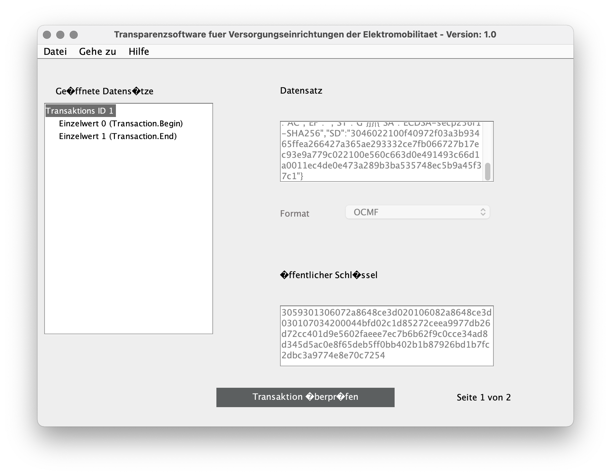
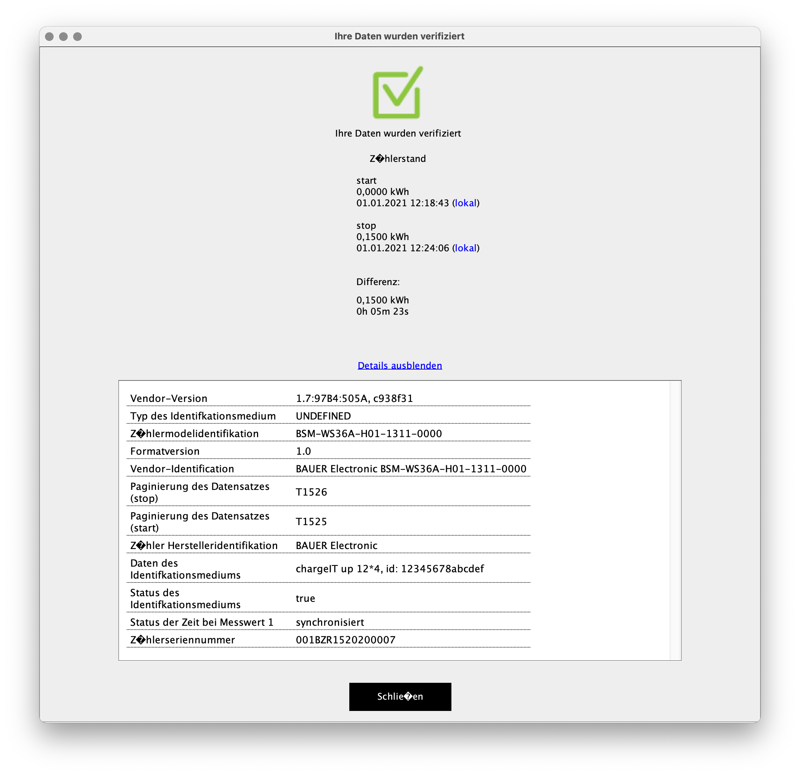

# Open Charge Metering Format (OCMF)

[Signed Snapshots](snapshots.md) shows how to create and work with snapshots.
For each of them, the BSM-WS36A provides an additional representation in the
[Open Charge Metering Format
(OCMF)](https://github.com/SAFE-eV/OCMF-Open-Charge-Metering-Format).

The OCMF representation is generated from the actual snapshot data when reading
from the appropriate model. It contains a subset of the snapshot's information,
presents the same time information and response counter and gets signed individually.


## Snapshots and Their Associated OCMF Representation

Each line in the following table shows a snapshot with its associated OCMF
representation:

| Snapshot                 | Snapshot Model                                             | OCMF Representation           | OCMF Model                                             |
| ------------------------ | ---------------------------------------------------------- | ----------------------------- | ------------------------------------------------------ |
| Signed Current Snapshot  | [bsm\_snapshot](../../bauer_bsm/bsm/models/smdx_64901.xml) | OCMF Signed Current Snapshot  | [bsm\_ocmf](../../bauer_bsm/bsm/models/smdx_64903.xml) |
| Signed Turn-On Snapshot  | [bsm\_snapshot](../../bauer_bsm/bsm/models/smdx_64901.xml) | OCMF Signed Turn-On Snapshot  | [bsm\_ocmf](../../bauer_bsm/bsm/models/smdx_64903.xml) |
| Signed Turn-Off Snapshot | [bsm\_snapshot](../../bauer_bsm/bsm/models/smdx_64901.xml) | OCMF Signed Turn-Off Snapshot | [bsm\_ocmf](../../bauer_bsm/bsm/models/smdx_64903.xml) |

[Model Instances](modbus-interface.md#model-instances) shows these model
instances.


## Getting the OCMF Representation

Create the snapshot as shown in [Snapshot
Creation](snapshots.md#snapshot-creation) and just read its associated OCMF
model instance afterwards.


## Snapshot Data in OCMF

The OCMF representation includes
[_Meta1_](../../../../bauer_bsm/bsm/models/smdx_64901.xml#L31) as customer
identification data which needs to be set appropriately. The other metadata
fields are ignored and will not appear in OCMF output.

The BSM-WS36A uses the reference cumulative register (OBIS ID 1-0:1.8.0\*198,
data point RCR) as _RV_ for the energy consumption in OCMF output. This
register gets reset when creating a _Signed Turn-On State_ and shows the actual
energy consumption at the time of crating _Signed Turn-Off Snapshot_. The
positive active energy (OBIS ID 1-0:1.8.0\*255, data point _TotWhImp_) is
included for informational purpose as _XV_.


## Example

### Preparation

Set time and some meta data:
```
$ bsmtool set bsm/epoch=1609491600 bsm/tzo=60
$ bsmtool set 'bsm/meta1=chargeIT up 12*4, id: 12345678abcdef' 'bsm/meta2=demo data 2'
```
```
--> 2a 10 9d44 0003 06 5feee490003c d4b0
<-- 2a 10 9d44 0003 e9aa
--> 2a 10 9d57 0078 f0 63686172676549542075702031322a342c2069643a203132333435363738616263646566000000000000000000000000000000000000000000000000000000000000000000000000000000000000000000000000000000000000000000000000000000000000000000000000000000000000000000000000000000000000000000000000000000000000000064656d6f206461746120320000000000000000000000000000000000000000000000000000000000000000000000000000000000000000000000000000000000000000000000000000000000000000000000000000000000000000000000000000000000 a4eb
<-- 2a 10 9d57 0078 584c
```

### Create Snapshot and Get OCMF Representation

- Trigger creating  _Signed Current Snapshot_ (not its OCMF representation)
    ```
    $ bsmtool create-snapshot scs
    ```
    ```
    --> 2a 10 9e4c 0001 02 0002 bca5
    <-- 2a 10 9e4c 0001 e9ed
    ```

- Poll snapshot status as shown in [Snapshot
  Creation](snapshots.md#snapshot-creation)


- When ready, read its OCMF representation from _OCMF Signed Current Snapshot_
    ```
    $ bsmtool get oscs
    bsm_ocmf:
        Typ: 0
        St: 0
        O: OCMF|{"FV":"1.0","GI":"BAUER Electronic BSM-WS36A-H01-1311-0000","GS":"001BZR1520200007","GV":"1.7:97B4:505A, c938f31","PG":"T1517","MV":"BAUER Electronic","MM":"BSM-WS36A-H01-1311-0000","MS":"001BZR1520200007","IS":true,"IT":"UNDEFINED","ID":"chargeIT up 12*4, id: 12345678abcdef","RD":[{"TM":"2021-01-01T10:17:17,000+0100 S","TX":"C","RV":20,"RI":"1-0:1.8.0*198","RU":"Wh","XV":36600,"XI":"1-0:1.8.0*255","XU":"Wh","RT":"AC","EF":"","ST":"G"}]}|{"SA":"ECDSA-secp256r1-SHA256","SD":"304402204315b5e451c161fbeebea54110814b56d56bd346a3587863872cb3bf05018949022060b1af8e041b027dc2b2be4218ec4567d2acc6c3c581c04630355e33bf7a0fbe"}
    ```
    ```
    --> 2a 03 a145 0002 f039
    <-- 2a 03 04 00000000 6131
    --> 2a 03 a147 007d 1019
    <-- 2a 03 fa 4f434d467c7b224656223a22312e30222c224749223a22424155455220456c656374726f6e69632042534d2d57533336412d4830312d313331312d30303030222c224753223a22303031425a5231353230323030303037222c224756223a22312e373a393742343a353035412c2063393338663331222c225047223a225431353137222c224d56223a22424155455220456c656374726f6e6963222c224d4d223a2242534d2d57533336412d4830312d313331312d30303030222c224d53223a22303031425a5231353230323030303037222c224953223a747275652c224954223a22554e444546494e4544222c224944223a22636861726765 b30a
    --> 2a 03 a1c4 007d e1f1
    <-- 2a 03 fa 49542075702031322a342c2069643a203132333435363738616263646566222c225244223a5b7b22544d223a22323032312d30312d30315431303a31373a31372c3030302b303130302053222c225458223a2243222c225256223a32302c225249223a22312d303a312e382e302a313938222c225255223a225768222c225856223a33363630302c225849223a22312d303a312e382e302a323535222c225855223a225768222c225254223a224143222c224546223a22222c225354223a2247227d5d7d7c7b225341223a2245434453412d7365637032353672312d534841323536222c225344223a2233303434303232303433313562356534 a44c
    --> 2a 03 a2410078305f
    <-- 2a 03 f0 35316331363166626565626561353431313038313462353664353662643334366133353837383633383732636233626630353031383934393032323036306231616638653034316230323764633262326265343231386563343536376432616363366333633538316330343633303335356533336266376130666265227d000000000000000000000000000000000000000000000000000000000000000000000000000000000000000000000000000000000000000000000000000000000000000000000000000000000000000000000000000000000000000000000000000000000000000000000000000000000000 a6c5
    ```


## Comparing Snapshot and OCMF Payload

### _Signed Current Snapshot_

This is the regular snapshot data which could be read from the meter. Note that
it contains data for _Meta2_ which is not present in its OCMF representation.
```
$ bsmtool get scs
bsm_snapshot:
    fixed:
        Typ: 0
        St: 0
        RCR: 20 Wh
        TotWhImp: 36600 Wh
        W: 0.0 W
        MA1: 001BZR1520200007
        RCnt: 1517
        OS: 1090237 s
        Epoch: 1609492637 s
        TZO: 60 min
        EpochSetCnt: 223
        EpochSetOS: 1089201 s
        DI: 1
        DO: 0
        Meta1: chargeIT up 12*4, id: 12345678abcdef
        Meta2: demo data 2
        Meta3: None
        Evt: 0
        NSig: 48
        BSig: 71
    repeating blocks blob:
        Sig: 3045022100b01bbfeeecb93a70aeacad747762dd2c811d3b2d854da14b5bd46cb4b0e704a30220729153a707f500441822c6d8f97160c3fb17e8d188bdeb159f31531dcd0c66fb
```
```
--> 2a 03 9e4b 0064 1dc4
<-- 2a 03 c8 000000000000001400008ef8000000000001303031425a5231353230323030303037000005ed0010a2bd5feee89d003c000000df00109eb10001000063686172676549542075702031322a342c2069643a2031323334353637386162636465660000000000000000000000000000000000000000000000000000000000000000000000000000000000000000000000000000000000000000000000000000000000000000000000000000000000000000000000000000000000000000000000000000000000000000 4543
--> 2a 03 9eaf 007d 9c39
<-- 2a 03 fa 64656d6f2064617461203200000000000000000000000000000000000000000000000000000000000000000000000000000000000000000000000000000000000000000000000000000000000000000000000000000000000000000000000000000000000000000000000000000000000000000000000000000000000000000000000000000000000000000000000000000000000000000000000000000000000000000000000000000000000000000000000000000000000000000000000000000000000000000000000000003000473045022100b01bbfeeecb93a70aeacad747762dd2c811d3b2d854da14b5bd46cb4b0e704a30220729153 6608
--> 2a 03 9f2c 001b ec07
<-- 2a 03 36 a707f500441822c6d8f97160c3fb17e8d188bdeb159f31531dcd0c66fb00000000000000000000000000000000000000000000000000 c846
```

### OCMF JSON Payload

This is its derived OCMF representation. To get a better view on the JSON
payload of the OCMF data, it could be pretty-printed using some shell tooling
and [`jq`](https://stedolan.github.io/jq/) as shown below. The current draft of
the [Open Charge Metering Format
Specification](https://github.com/SAFE-eV/OCMF-Open-Charge-Metering-Format/blob/176d59b7e4cf6eecbbdcbb056a08fdb201ed8ff5/OCMF-de.md#sektionen)
explains the keys used here.
```json
$ bsmtool get oscs/o | cut -d \| -f 2 | jq .
{
  "FV": "1.0",
  "GI": "BAUER Electronic BSM-WS36A-H01-1311-0000",
  "GS": "001BZR1520200007",
  "GV": "1.7:97B4:505A, c938f31",
  "PG": "T1517",
  "MV": "BAUER Electronic",
  "MM": "BSM-WS36A-H01-1311-0000",
  "MS": "001BZR1520200007",
  "IS": true,
  "IT": "UNDEFINED",
  "ID": "chargeIT up 12*4, id: 12345678abcdef",
  "RD": [
    {
      "TM": "2021-01-01T10:17:17,000+0100 S",
      "TX": "C",
      "RV": 20,
      "RI": "1-0:1.8.0*198",
      "RU": "Wh",
      "XV": 36600,
      "XI": "1-0:1.8.0*255",
      "XU": "Wh",
      "RT": "AC",
      "EF": "",
      "ST": "G"
    }
  ]
}
```


## OCMF XML

In the context of electric vehicle charging, OCMF data gets usually validated
by a so-called Transparenzsoftware. There are several implementations at the
market and among them the [S.A.F.E. e.V.
Transparenzsoftware](https://www.safe-ev.de/de/transparenzsoftware.php) which
uses an XML envelope.

The XML envelope includes the OCMF data taken before starting and after
terminating the charging process along with the public key used for signing.
The format could be generated from a
[template](../../bauer_bsm/bsm/client.py#L214) where the actual data gets
inserted.


### Generating OCMF XML

The [BSM Python support](../../bauer_bsm/bsm/client.py#L183) and the BSM Tool
support the generation of OCMF XML data for _OCMF Signed Turn-On Snapshot_ and
_OCMF Signed Turn-Off Snapshot_ when the corresponding snapshots have already
been successfully created. To generate an OCMF XML envelope, invoke the BSM
Tool as follows:

- Create _Signed Turn-On Snapshot_
    ```
    $ bsmtool get-snapshot stons
    Updating 'stons' succeeded
    Snapshot data:
    bsm_snapshot:
        fixed:
            Typ: 1
            St: 0
            RCR: None
            TotWhImp: 37030 Wh
            W: 0.0 W
            MA1: 001BZR1520200007
            RCnt: 1525
            OS: 1100021 s
            Epoch: 1609499923 s
            TZO: 60 min
            EpochSetCnt: 223
            EpochSetOS: 1089201 s
            DI: 1
            DO: 0
            Meta1: chargeIT up 12*4, id: 12345678abcdef
            Meta2: demo data 2
            Meta3: None
            Evt: 0
            NSig: 48
            BSig: 71
        repeating blocks blob:
            Sig: 304502200cbeb03ab97799641844c3c5433829cad7fcd1693ca70d70c80b34cd1283b2ee022100cb6c212f54c2f9d177b8119cc9e43f18e6761a215edc67f163f5916be24f6f6d
    ```
    ```
    --> 2a 10 9f4a 0001 02 0002 ac03
    <-- 2a 10 9f4a 0001 0810
    --> 2a 03 9f49 0064 bdf8
    <-- 2a 03 c8 0001000000000000000090a6000000000001303031425a5231353230323030303037000005f50010c8f55fef0513003c000000df00109eb10001000063686172676549542075702031322a342c2069643a2031323334353637386162636465660000000000000000000000000000000000000000000000000000000000000000000000000000000000000000000000000000000000000000000000000000000000000000000000000000000000000000000000000000000000000000000000000000000000000000 3aab
    --> 2a 03 9fad 007d 3c05
    <-- 2a 03 fa 64656d6f206461746120320000000000000000000000000000000000000000000000000000000000000000000000000000000000000000000000000000000000000000000000000000000000000000000000000000000000000000000000000000000000000000000000000000000000000000000000000000000000000000000000000000000000000000000000000000000000000000000000000000000000000000000000000000000000000000000000000000000000000000000000000000000000000000000000000000300047304502200cbeb03ab97799641844c3c5433829cad7fcd1693ca70d70c80b34cd1283b2ee022100cb6c21 0d37
    --> 2a 03 a02a 001b 0012
    <-- 2a 03 36 2f54c2f9d177b8119cc9e43f18e6761a215edc67f163f5916be24f6f6d00000000000000000000000000000000000000000000000000 183d
    ```

- Create _Signed Turn-Off Snapshot_
    ```
    $ bsmtool get-snapshot stoffs
    Updating 'stoffs' succeeded
    Snapshot data:
    bsm_snapshot:
        fixed:
            Typ: 2
            St: 0
            RCR: 150 Wh
            TotWhImp: 37190 Wh
            W: 0.0 W
            MA1: 001BZR1520200007
            RCnt: 1526
            OS: 1100344 s
            Epoch: 1609500246 s
            TZO: 60 min
            EpochSetCnt: 223
            EpochSetOS: 1089201 s
            DI: 1
            DO: 0
            Meta1: chargeIT up 12*4, id: 12345678abcdef
            Meta2: demo data 2
            Meta3: None
            Evt: 0
            NSig: 48
            BSig: 72
        repeating blocks blob:
            Sig: 3046022100ccd50ad5a11bd954009b31018a31c325992702b382a072bd460f8e88c6673414022100bb91b62cda24498ca0e54e1f89352d187d4d35c4ac5da439a471d331db47b7bc
    ```
    ```
    --> 2a 10 a048 0001 02 0002 62e2
    <-- 2a 10 a048 0001 a5c4
    --> 2a 03 a047 0064 d02f
    <-- 2a 03 c8 000200000000009600009146000000000001303031425a5231353230323030303037000005f60010ca385fef0656003c000000df00109eb10001000063686172676549542075702031322a342c2069643a2031323334353637386162636465660000000000000000000000000000000000000000000000000000000000000000000000000000000000000000000000000000000000000000000000000000000000000000000000000000000000000000000000000000000000000000000000000000000000000000 fe8a
    --> 2a 03 a0ab 007d d010
    <-- 2a 03 fa 64656d6f2064617461203200000000000000000000000000000000000000000000000000000000000000000000000000000000000000000000000000000000000000000000000000000000000000000000000000000000000000000000000000000000000000000000000000000000000000000000000000000000000000000000000000000000000000000000000000000000000000000000000000000000000000000000000000000000000000000000000000000000000000000000000000000000000000000000000000003000483046022100ccd50ad5a11bd954009b31018a31c325992702b382a072bd460f8e88c6673414022100bb91 ceff
    --> 2a 03 a128 001b a02e
    <-- 2a 03 36 b62cda24498ca0e54e1f89352d187d4d35c4ac5da439a471d331db47b7bc000000000000000000000000000000000000000000000000 5072
    ```

- Generate OCMF XML envelope for both snapshots
    ```xml
    $ bsmtool ocmf-xml
    <?xml version="1.0" encoding="ISO-8859-1" standalone="yes"?>
    <values>
      <value transactionId="1" context="Transaction.Begin">
        <signedData format="OCMF" encoding="plain">OCMF|{"FV":"1.0","GI":"BAUER Electronic BSM-WS36A-H01-1311-0000","GS":"001BZR1520200007","GV":"1.7:97B4:505A, c938f31","PG":"T1525","MV":"BAUER Electronic","MM":"BSM-WS36A-H01-1311-0000","MS":"001BZR1520200007","IS":true,"IT":"UNDEFINED","ID":"chargeIT up 12*4, id: 12345678abcdef","RD":[{"TM":"2021-01-01T12:18:43,000+0100 S","TX":"B","RV":0,"RI":"1-0:1.8.0*198","RU":"Wh","XV":37030,"XI":"1-0:1.8.0*255","XU":"Wh","RT":"AC","EF":"","ST":"G"}]}|{"SA":"ECDSA-secp256r1-SHA256","SD":"3046022100f40972f03a3b93465ffea266427a365ae293332ce7fb066727b17ec93e9a779c022100e560c663d0e491493c66d1a0011ec4de0e473a289b3ba535748ec5b9a45f37c1"}</signedData>
        <publicKey encoding="plain">3059301306072a8648ce3d020106082a8648ce3d030107034200044bfd02c1d85272ceea9977db26d72cc401d9e5602faeee7ec7b6b62f9c0cce34ad8d345d5ac0e8f65deb5ff0bb402b1b87926bd1b7fc2dbc3a9774e8e70c7254</publicKey>
      </value>
      <value transactionId="1" context="Transaction.End">
        <signedData format="OCMF" encoding="plain">OCMF|{"FV":"1.0","GI":"BAUER Electronic BSM-WS36A-H01-1311-0000","GS":"001BZR1520200007","GV":"1.7:97B4:505A, c938f31","PG":"T1526","MV":"BAUER Electronic","MM":"BSM-WS36A-H01-1311-0000","MS":"001BZR1520200007","IS":true,"IT":"UNDEFINED","ID":"chargeIT up 12*4, id: 12345678abcdef","RD":[{"TM":"2021-01-01T12:24:06,000+0100 S","TX":"E","RV":150,"RI":"1-0:1.8.0*198","RU":"Wh","XV":37190,"XI":"1-0:1.8.0*255","XU":"Wh","RT":"AC","EF":"","ST":"G"}]}|{"SA":"ECDSA-secp256r1-SHA256","SD":"30450220306a84137ebde416847b3007a24ff53d66c444998ea8c61605a2142be86d5df9022100cfa1f381883dcc4c7fa7526d6b9a81e8656c4f565b935c941ea12407dbb3b262"}</signedData>
        <publicKey encoding="plain">3059301306072a8648ce3d020106082a8648ce3d030107034200044bfd02c1d85272ceea9977db26d72cc401d9e5602faeee7ec7b6b62f9c0cce34ad8d345d5ac0e8f65deb5ff0bb402b1b87926bd1b7fc2dbc3a9774e8e70c7254</publicKey>
      </value>
    </values>
    ```
    ```
    --> 2a 03 9d07 0050 dd80
    <-- 2a 03 a0 30303030303030303230323030303037000000000000000030303062353730303030363063623035312e373a393742343a3530354100000063393338663331000000000000000000303031425a5231353230323030303037303430303432000000000000000000000000009600000000037b000005f60010ca535fef0671003c000000df00109eb1000100000010ca325fef0650003c0010ca325fef0650003c 2d6f
    --> 2a 03 9d57 0078 dd8f
    <-- 2a 03 f0 63686172676549542075702031322a342c2069643a203132333435363738616263646566000000000000000000000000000000000000000000000000000000000000000000000000000000000000000000000000000000000000000000000000000000000000000000000000000000000000000000000000000000000000000000000000000000000000000064656d6f206461746120320000000000000000000000000000000000000000000000000000000000000000000000000000000000000000000000000000000000000000000000000000000000000000000000000000000000000000000000000000000000 f371
    --> 2a 03 9dcf 0064 5da9
    <-- 2a 03 c8 000000000000000000000000000000000000000000000000000000000000000000000000000000000000000000000000000000000000000000000000000000000000000000000000000000000000000000000000000000000000000000000000000000000030005b3059301306072a8648ce3d020106082a8648ce3d030107034200044bfd02c1d85272ceea9977db26d72cc401d9e5602faeee7ec7b6b62f9c0cce34ad8d345d5ac0e8f65deb5ff0bb402b1b87926bd1b7fc2dbc3a9774e8e70c72540000000000 3c73
    --> 2a 03 a2bb 0002 918d
    <-- 2a 03 04 00010000 30f1
    --> 2a 03 a2bd 007d 306c
    <-- 2a 03 fa 4f434d467c7b224656223a22312e30222c224749223a22424155455220456c656374726f6e69632042534d2d57533336412d4830312d313331312d30303030222c224753223a22303031425a5231353230323030303037222c224756223a22312e373a393742343a353035412c2063393338663331222c225047223a225431353235222c224d56223a22424155455220456c656374726f6e6963222c224d4d223a2242534d2d57533336412d4830312d313331312d30303030222c224d53223a22303031425a5231353230323030303037222c224953223a747275652c224954223a22554e444546494e4544222c224944223a22636861726765 da94
    --> 2a 03 a33a 007d 81b9
    <-- 2a 03 fa 49542075702031322a342c2069643a203132333435363738616263646566222c225244223a5b7b22544d223a22323032312d30312d30315431323a31383a34332c3030302b303130302053222c225458223a2242222c225256223a302c225249223a22312d303a312e382e302a313938222c225255223a225768222c225856223a33373033302c225849223a22312d303a312e382e302a323535222c225855223a225768222c225254223a224143222c224546223a22222c225354223a2247227d5d7d7c7b225341223a2245434453412d7365637032353672312d534841323536222c225344223a223330343630323231303066343039373266 0213
    --> 2a 03 a3b7 0078 d191
    <-- 2a 03 f0 30336133623933343635666665613236363432376133363561653239333333326365376662303636373237623137656339336539613737396330323231303065353630633636336430653439313439336336366431613030313165633464653065343733613238396233626135333537343865633562396134356633376331227d000000000000000000000000000000000000000000000000000000000000000000000000000000000000000000000000000000000000000000000000000000000000000000000000000000000000000000000000000000000000000000000000000000000000000000000000000000 a9b7
    --> 2a 03 a431 0002 b0ef
    <-- 2a 03 04 00020000 c0f1
    --> 2a 03 a4 33007d 50cf
    <-- 2a 03 fa 4f434d467c7b224656223a22312e30222c224749223a22424155455220456c656374726f6e69632042534d2d57533336412d4830312d313331312d30303030222c224753223a22303031425a5231353230323030303037222c224756223a22312e373a393742343a353035412c2063393338663331222c225047223a225431353236222c224d56223a22424155455220456c656374726f6e6963222c224d4d223a2242534d2d57533336412d4830312d313331312d30303030222c224d53223a22303031425a5231353230323030303037222c224953223a747275652c224954223a22554e444546494e4544222c224944223a22636861726765 8e65
    --> 2a 03 a4b0 007d a127
    <-- 2a 03 fa 49542075702031322a342c2069643a203132333435363738616263646566222c225244223a5b7b22544d223a22323032312d30312d30315431323a32343a30362c3030302b303130302053222c225458223a2245222c225256223a3135302c225249223a22312d303a312e382e302a313938222c225255223a225768222c225856223a33373139302c225849223a22312d303a312e382e302a323535222c225855223a225768222c225254223a224143222c224546223a22222c225354223a2247227d5d7d7c7b225341223a2245434453412d7365637032353672312d534841323536222c225344223a22333034353032323033303661383431 391e
    --> 2a 03 a52d 0078 f136
    <-- 2a 03 f0 33376562646534313638343762333030376132346666353364363663343434393938656138633631363035613231343262653836643564663930323231303063666131663338313838336463633463376661373532366436623961383165383635366334663536356239333563393431656131323430376462623362323632227d000000000000000000000000000000000000000000000000000000000000000000000000000000000000000000000000000000000000000000000000000000000000000000000000000000000000000000000000000000000000000000000000000000000000000000000000000000 e8da
    ```


### Example OCMF XML Payload

- Start
    ```json
    {
      "FV": "1.0",
      "GI": "BAUER Electronic BSM-WS36A-H01-1311-0000",
      "GS": "001BZR1520200007",
      "GV": "1.7:97B4:505A, c938f31",
      "PG": "T1525",
      "MV": "BAUER Electronic",
      "MM": "BSM-WS36A-H01-1311-0000",
      "MS": "001BZR1520200007",
      "IS": true,
      "IT": "UNDEFINED",
      "ID": "chargeIT up 12*4, id: 12345678abcdef",
      "RD": [
        {
          "TM": "2021-01-01T12:18:43,000+0100 S",
          "TX": "B",
          "RV": 0,
          "RI": "1-0:1.8.0*198",
          "RU": "Wh",
          "XV": 37030,
          "XI": "1-0:1.8.0*255",
          "XU": "Wh",
          "RT": "AC",
          "EF": "",
          "ST": "G"
        }
      ]
    }
    ```

- End
    ```json
    {
      "FV": "1.0",
      "GI": "BAUER Electronic BSM-WS36A-H01-1311-0000",
      "GS": "001BZR1520200007",
      "GV": "1.7:97B4:505A, c938f31",
      "PG": "T1526",
      "MV": "BAUER Electronic",
      "MM": "BSM-WS36A-H01-1311-0000",
      "MS": "001BZR1520200007",
      "IS": true,
      "IT": "UNDEFINED",
      "ID": "chargeIT up 12*4, id: 12345678abcdef",
      "RD": [
        {
          "TM": "2021-01-01T12:24:06,000+0100 S",
          "TX": "E",
          "RV": 150,
          "RI": "1-0:1.8.0*198",
          "RU": "Wh",
          "XV": 37190,
          "XI": "1-0:1.8.0*255",
          "XU": "Wh",
          "RT": "AC",
          "EF": "",
          "ST": "G"
        }
      ]
    }
    ```


### OCMF XML Verification

The OCMF XML envelope [`ocmf-xml-envelope.xml`](data/ocmf-xml-envelope.xml)
from the example above can be verified with the [S.A.F.E. e.V.
Transparenzsoftware](https://www.safe-ev.de/de/transparenzsoftware.php) which
by loading the file and clicking on _Transaktion überprüfen_:



