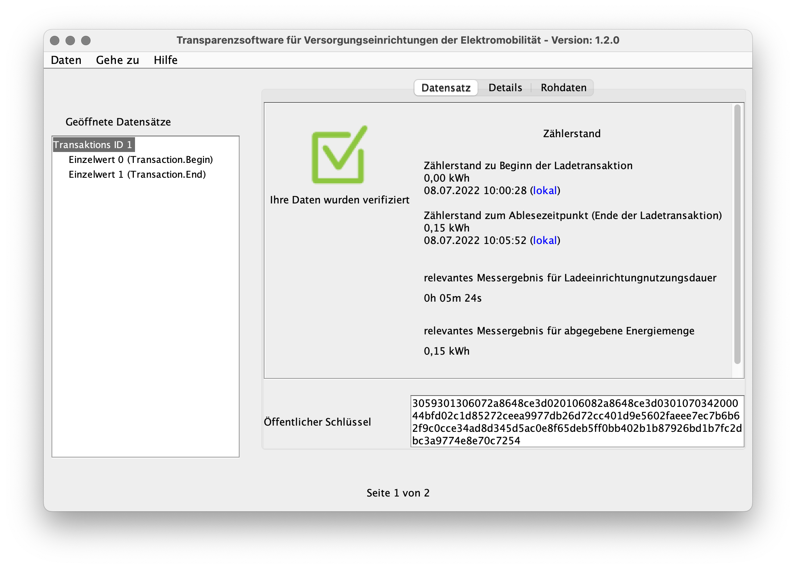

# Open Charge Metering Format (OCMF)

[Signed Snapshots](snapshots.md) shows how to create and work with snapshots.
For each of them, the BSM-WS36A provides an additional representation in the
[Open Charge Metering Format
(OCMF)](https://github.com/SAFE-eV/OCMF-Open-Charge-Metering-Format).

The OCMF representation is generated from the actual snapshot data when reading
from the appropriate model. It contains a subset of the snapshot's information,
presents the same time information and response counter and gets signed individually.


## Snapshots and Their Associated OCMF Representation

Each line in the following table shows a snapshot with its associated OCMF
representation:

| Snapshot                 | Snapshot Model                                             | OCMF Representation           | OCMF Model                                             |
| ------------------------ | ---------------------------------------------------------- | ----------------------------- | ------------------------------------------------------ |
| Signed Current Snapshot  | [bsm\_snapshot](../../bauer_bsm/bsm/models/smdx_64901.xml) | OCMF Signed Current Snapshot  | [bsm\_ocmf](../../bauer_bsm/bsm/models/smdx_64903.xml) |
| Signed Turn-On Snapshot  | [bsm\_snapshot](../../bauer_bsm/bsm/models/smdx_64901.xml) | OCMF Signed Turn-On Snapshot  | [bsm\_ocmf](../../bauer_bsm/bsm/models/smdx_64903.xml) |
| Signed Turn-Off Snapshot | [bsm\_snapshot](../../bauer_bsm/bsm/models/smdx_64901.xml) | OCMF Signed Turn-Off Snapshot | [bsm\_ocmf](../../bauer_bsm/bsm/models/smdx_64903.xml) |
| Signed Start Snapshot    | [bsm\_snapshot](../../bauer_bsm/bsm/models/smdx_64901.xml) | OCMF Signed Start Snapshot    | [bsm\_ocmf](../../bauer_bsm/bsm/models/smdx_64903.xml) |
| Signed End Snapshot      | [bsm\_snapshot](../../bauer_bsm/bsm/models/smdx_64901.xml) | OCMF Signed End Snapshot      | [bsm\_ocmf](../../bauer_bsm/bsm/models/smdx_64903.xml) |

[Model Instances](modbus-interface.md#model-instances) shows these model
instances.


## Getting the OCMF Representation

Create the snapshot as shown in [Snapshot
Creation](snapshots.md#snapshot-creation) and just read its associated OCMF
model instance afterwards.


## Snapshot Data in OCMF

The OCMF representation includes
[_Meta1_](../../bauer_bsm/bsm/models/smdx_64901.xml#L33) as customer
identification data which needs to be set appropriately. The other metadata
fields are ignored and will not appear in OCMF output.

The BSM-WS36A uses the reference cumulative register (OBIS ID 1-0:1.8.0\*198,
data point RCR) as _RV_ for the energy consumption in OCMF output. This
register gets reset when creating a _Signed Turn-On State_ and shows the actual
energy consumption at the time of crating _Signed Turn-Off Snapshot_. The
positive active energy (OBIS ID 1-0:1.8.0\*255, data point _TotWhImp_) is
included for informational purpose as _XV_.


## Example

### Preparation

Set time and some meta data:
```
$ bsmtool set bsm/epoch=1609491600 bsm/tzo=60
$ bsmtool set 'bsm/meta1=contract-id: rfid:12345678abcdef' 'bsm/meta2=evse-id: DE*BDO*E8025334492*2' 'bsm/meta3=csc-sw-version: v1.2.34'
```
```
--> 2a 10 9d44 0003 06 5feee490003c d4b0
<-- 2a 10 9d44 0003 e9aa

--> 2a 10 9d57 0078 f0 636f6e74726163742d69643a20726669643a3132333435363738616263646566000000000000000000000000000000000000000000000000000000000000000000000000000000000000000000000000000000000000000000000000000000000000000000000000000000000000000000000000000000000000000000000000000000000000000000000000657673652d69643a2044452a42444f2a45383032353333343439322a320000000000000000000000000000000000000000000000000000000000000000000000000000000000000000000000000000000000000000000000000000000000000000000000 195c
<-- 2a 10 9d57 0078 584c
--> 2a 10 9dcf 0032 64 6373632d73772d76657273696f6e3a2076312e322e33340000000000000000000000000000000000000000000000000000000000000000000000000000000000000000000000000000000000000000000000000000000000000000000000000000000000 f0c8
<-- 2a 10 9dcf 0032 5854
```

### Create Snapshot and Get OCMF Representation

- Trigger creating  _Signed Current Snapshot_ (not its OCMF representation)
    ```
    $ bsmtool create-snapshot scs
    ```
    ```
    --> 2a 10 9e4c 0001 02 0002 bca5
    <-- 2a 10 9e4c 0001 e9ed
    ```

- Poll snapshot status as shown in [Snapshot
  Creation](snapshots.md#snapshot-creation)


- When ready, read its OCMF representation from _OCMF Signed Current Snapshot_
    ```
    $ bsmtool get oscs
    bsm_ocmf:
        Typ: 0
        St: 0
        O: OCMF|{"FV":"1.0","GI":"BAUER Electronic BSM-WS36A-H01-1311-0000","GS":"001BZR1521070006","GV":"1.9:32CA:AFF4, 6d1dd3c","PG":"T22990","MV":"BAUER Electronic","MM":"BSM-WS36A-H01-1311-0000","MS":"001BZR1521070006","IS":true,"IT":"UNDEFINED","ID":"contract-id: rfid:12345678abcdef","RD":[{"TM":"2021-01-01T10:00:39,000+0100 U","TX":"C","RV":0,"RI":"1-0:1.8.0*198","RU":"Wh","XV":52620,"XI":"1-0:1.8.0*255","XU":"Wh","XT":0,"RT":"AC","EF":"","ST":"G"}]}|{"SA":"ECDSA-secp256r1-SHA256","SD":"3046022100806de4c69300a60473dae527cdb5bdabd04bdacbe83713408039545efe4d8a94022100938cf70885a2866e1f694b13f10f6afbb975f97a21590fcd670298dd400702ca"}
    ```
    ```
    --> 2a 03 a341 0002 b040
    <-- 2a 03 04 00000000 6131
    --> 2a 03 a343 007d 5060
    <-- 2a 03 fa 4f434d467c7b224656223a22312e30222c224749223a22424155455220456c656374726f6e69632042534d2d57533336412d4830312d313331312d30303030222c224753223a22303031425a5231353231303730303036222c224756223a22312e393a333243413a414646342c2036643164643363222c225047223a22543232393930222c224d56223a22424155455220456c656374726f6e6963222c224d4d223a2242534d2d57533336412d4830312d313331312d30303030222c224d53223a22303031425a5231353231303730303036222c224953223a747275652c224954223a22554e444546494e4544222c224944223a22636f6e7472 d949
    --> 2a 03 a3c0 007d a188
    <-- 2a 03 fa 6163742d69643a20726669643a3132333435363738616263646566222c225244223a5b7b22544d223a22323032312d30312d30315431303a30303a33392c3030302b303130302055222c225458223a2243222c225256223a302c225249223a22312d303a312e382e302a313938222c225255223a225768222c225856223a35323632302c225849223a22312d303a312e382e302a323535222c225855223a225768222c225854223a302c225254223a224143222c224546223a22222c225354223a2247227d5d7d7c7b225341223a2245434453412d7365637032353672312d534841323536222c225344223a2233303436303232313030383036 b113
    --> 2a 03 a43d 007d 310c
    <-- 2a 03 fa 6465346336393330306136303437336461653532376364623562646162643034626461636265383337313334303830333935343565666534643861393430323231303039333863663730383835613238363665316636393462313366313066366166626239373566393761323135393066636436373032393864643430303730326361227d000000000000000000000000000000000000000000000000000000000000000000000000000000000000000000000000000000000000000000000000000000000000000000000000000000000000000000000000000000000000000000000000000000000000000000000000000000000000000000 f084
    --> 2a 03 a4ba 0079 80e6
    <-- 2a 03 f2 0000000000000000000000000000000000000000000000000000000000000000000000000000000000000000000000000000000000000000000000000000000000000000000000000000000000000000000000000000000000000000000000000000000000000000000000000000000000000000000000000000000000000000000000000000000000000000000000000000000000000000000000000000000000000000000000000000000000000000000000000000000000000000000000000000000000000000000000000000000000000000000000000000000000000000000000000000000000000000000000000000 443c
    ```


## Comparing Snapshot and OCMF Payload

### _Signed Current Snapshot_

This is the regular snapshot data which could be read from the meter. Note that
it contains data for _Meta2_ and _Meta3_ which is not present in its OCMF
representation.
```
$ bsmtool get scs
bsm_snapshot:
    fixed:
        Typ: 0
        St: 0
        RCR: None
        TotWhImp: 52620 Wh
        W: 0.0 W
        MA1: 001BZR1521070006
        RCnt: 22990
        OS: 1985331 s
        Epoch: 1609491639 s
        TZO: 60 min
        EpochSetCnt: 2820
        EpochSetOS: 1985293 s
        DI: 1
        DO: 0
        Meta1: contract-id: rfid:12345678abcdef
        Meta2: evse-id: DE*BDO*E8025334492*2
        Meta3: csc-sw-version: v1.2.34
        Evt: 0
        NSig: 48
        BSig: 70
    repeating blocks blob:
        Sig: 304402200c02ca09e8ef1477e324c80ecf9bec8ef2731f5335e3325273ab7b9741f63491022004571d5f7f63f2ceef2bfbd1e892ee631c3cf1ae0565a5de6250d075771a7562
```
```
--> 2a 03 9e4b 0064 1dc4
<-- 2a 03 c8 00000000000000000000cd8c000000000001303031425a5231353231303730303036000059ce001e4b335feee4b7003c00000b04001e4b0d00010000636f6e74726163742d69643a20726669643a3132333435363738616263646566000000000000000000000000000000000000000000000000000000000000000000000000000000000000000000000000000000000000000000000000000000000000000000000000000000000000000000000000000000000000000000000000000000000000000000000000 c929
--> 2a 03 9eaf 007d 9c39
<-- 2a 03 fa 657673652d69643a2044452a42444f2a45383032353333343439322a3200000000000000000000000000000000000000000000000000000000000000000000000000000000000000000000000000000000000000000000000000000000000000000000006373632d73772d76657273696f6e3a2076312e322e333400000000000000000000000000000000000000000000000000000000000000000000000000000000000000000000000000000000000000000000000000000000000000000000000000000000000000000000300046304402200c02ca09e8ef1477e324c80ecf9bec8ef2731f5335e3325273ab7b9741f63491022004571d5f a922
--> 2a 03 9f2c 001b ec07
<-- 2a 03 36 7f63f2ceef2bfbd1e892ee631c3cf1ae0565a5de6250d075771a75620000000000000000000000000000000000000000000000000000 e724
```

### OCMF JSON Payload

This is its derived OCMF representation. To get a better view on the JSON
payload of the OCMF data, it could be pretty-printed using some shell tooling
and [`jq`](https://stedolan.github.io/jq/) as shown below.
```json
$ bsmtool get oscs/o | cut -d \| -f 2 | jq .
{
  "FV": "1.0",
  "GI": "BAUER Electronic BSM-WS36A-H01-1311-0000",
  "GS": "001BZR1521070006",
  "GV": "1.9:32CA:AFF4, 6d1dd3c",
  "PG": "T22990",
  "MV": "BAUER Electronic",
  "MM": "BSM-WS36A-H01-1311-0000",
  "MS": "001BZR1521070006",
  "IS": true,
  "IT": "UNDEFINED",
  "ID": "contract-id: rfid:12345678abcdef",
  "RD": [
    {
      "TM": "2021-01-01T10:00:39,000+0100 U",
      "TX": "C",
      "RV": 0,
      "RI": "1-0:1.8.0*198",
      "RU": "Wh",
      "XV": 52620,
      "XI": "1-0:1.8.0*255",
      "XU": "Wh",
      "XT": 0,
      "RT": "AC",
      "EF": "",
      "ST": "G"
    }
  ]
}
```
The current draft of the [Open Charge Metering Format
Specification](https://github.com/SAFE-eV/OCMF-Open-Charge-Metering-Format/blob/176d59b7e4cf6eecbbdcbb056a08fdb201ed8ff5/OCMF-de.md#sektionen)
explains the standard keys used here. Reading value is the reference cumulative register _RCR_:
- _RV_: its actual value [_RCR_](../../bauer_bsm/bsm/models/smdx_64901.xml#L19)
- _RI_: _RCR_'s OBIS ID
- _RU_: _RCR_'s [unit](../../bauer_bsm/bsm/models/smdx_64901.xml#L19)

In addition, four vendor-specific keys are used in the reading data:
- _XV_: the additional total watt hours imported counter [_TotWhImp_](../../bauer_bsm/bsm/models/smdx_64901.xml#L20)
- _XI_: _TotWhImp_'s OBIS ID
- _XU_: _TotWhImp_'s [unit](../../bauer_bsm/bsm/models/smdx_64901.xml#L20)
- _XT_: the underlying snapshot's type [_Typ_](../../bauer_bsm/bsm/models/smdx_64901.xml#L4)


## OCMF XML

In the context of electric vehicle charging, OCMF data gets usually validated
by a so-called Transparenzsoftware. There are several implementations at the
market and among them the [S.A.F.E. e.V.
Transparenzsoftware](https://www.safe-ev.de/de/transparenzsoftware.php) which
uses an XML envelope.

The XML envelope includes the OCMF data taken before starting and after
terminating the charging process along with the public key used for signing.
The format could be generated from a
[template](../../bauer_bsm/exporter/ocmf.py#L48) where the actual data gets
inserted.


### Generating OCMF XML

The [BSM Python support](../../bauer_bsm/exporter/ocmf.py#L12) and the [BSM
Tool](../../bauer_bsm/cli/bsmtool.py#L419) support the generation of OCMF XML
data for the OCMF representation of a pair of already created snapshots (the
switching snapshots _OCMF Signed Turn-On Snapshot_ and _OCMF Signed Turn-Off
Snapshot_ or the non-switching _OCMF Signed Start Snapshot_ and _OCMF Signed
End Snapshot_). To generate an OCMF XML envelope for the switching snapshots,
invoke the BSM Tool as follows:

- Create _Signed Turn-On Snapshot_
    ```
    $ bsmtool get-snapshot stons
    bsm_snapshot:
        fixed:
            Typ: 1
            St: 0
            RCR: None
            TotWhImp: 52440 Wh
            W: 0.0 W
            MA1: 001BZR1521070006
            RCnt: 22978
            OS: 1867397 s
            Epoch: 1609491627 s
            TZO: 60 min
            EpochSetCnt: 2814
            EpochSetOS: 1867371 s
            DI: 1
            DO: 0
            Meta1: contract-id: rfid:12345678abcdef
            Meta2: evse-id: DE*BDO*E8025334492*2
            Meta3: csc-sw-version: v1.2.34
            Evt: 0
            NSig: 48
            BSig: 72
        repeating blocks blob:
            Sig: 3046022100abf6b2c50a4021f58d075e1df434dc96f1625df66142ec32c6ab831942631c3e022100f863e4aeccee44755302a38b4a08431835b645247b1db2cfecceaa7fe017cb4a
    ```
    ```
    --> 2a 10 9f4a 0001 02 0002 ac03
    <-- 2a 10 9f4a 0001 0810
    --> 2a 03 9f49 0064 bdf8
    <-- 2a 03 c8 00010000000000000000ccd8000000000001303031425a5231353231303730303036000059c2001c7e855feee4ab003c00000afe001c7e6b00010000636f6e74726163742d69643a20726669643a3132333435363738616263646566000000000000000000000000000000000000000000000000000000000000000000000000000000000000000000000000000000000000000000000000000000000000000000000000000000000000000000000000000000000000000000000000000000000000000000000000 3fae
    --> 2a 03 9fad 007d 3c05
    <-- 2a 03 fa 657673652d69643a2044452a42444f2a45383032353333343439322a3200000000000000000000000000000000000000000000000000000000000000000000000000000000000000000000000000000000000000000000000000000000000000000000006373632d73772d76657273696f6e3a2076312e322e3334000000000000000000000000000000000000000000000000000000000000000000000000000000000000000000000000000000000000000000000000000000000000000000000000000000000000000000003000483046022100abf6b2c50a4021f58d075e1df434dc96f1625df66142ec32c6ab831942631c3e022100f863 9652
    --> 2a 03 a02a 001b 0012
    <-- 2a 03 36 e4aeccee44755302a38b4a08431835b645247b1db2cfecceaa7fe017cb4a000000000000000000000000000000000000000000000000 23bd
    ```

- Create _Signed Turn-Off Snapshot_
    ```
    $ bsmtool get-snapshot stoffs
    bsm_snapshot:
        fixed:
            Typ: 2
            St: 0
            RCR: 160 Wh
            TotWhImp: 52610 Wh
            W: 0.0 W
            MA1: 001BZR1521070006
            RCnt: 22979
            OS: 1867722 s
            Epoch: 1609491952 s
            TZO: 60 min
            EpochSetCnt: 2814
            EpochSetOS: 1867371 s
            DI: 1
            DO: 0
            Meta1: contract-id: rfid:12345678abcdef
            Meta2: evse-id: DE*BDO*E8025334492*2
            Meta3: csc-sw-version: v1.2.34
            Evt: 0
            NSig: 48
            BSig: 70
        repeating blocks blob:
            Sig: 3044022062f36e0583471d4f438da9da549be550cdbdfa4f9d77f3d4c53339f18c66850a02200e997ccb47cb33b1fb6c504b081b097cb65231b041c9f882122cc8298f575501
    ```
    ```
    --> 2a 10 a048 0001 02 0002 62e2
    <-- 2a 10 a048 0001 a5c4
    --> 2a 03 a047 0064 d02f
    <-- 2a 03 c8 00020000000000a00000cd82000000000001303031425a5231353231303730303036000059c3001c7fca5feee5f0003c00000afe001c7e6b00010000636f6e74726163742d69643a20726669643a3132333435363738616263646566000000000000000000000000000000000000000000000000000000000000000000000000000000000000000000000000000000000000000000000000000000000000000000000000000000000000000000000000000000000000000000000000000000000000000000000000 7eb9
    --> 2a 03 a0ab 007d d010
    <-- 2a 03 fa 657673652d69643a2044452a42444f2a45383032353333343439322a3200000000000000000000000000000000000000000000000000000000000000000000000000000000000000000000000000000000000000000000000000000000000000000000006373632d73772d76657273696f6e3a2076312e322e3334000000000000000000000000000000000000000000000000000000000000000000000000000000000000000000000000000000000000000000000000000000000000000000000000000000000000000000003000463044022062f36e0583471d4f438da9da549be550cdbdfa4f9d77f3d4c53339f18c66850a02200e997ccb 3f14
    --> 2a 03 a128 001b a02e
    <-- 2a 03 36 47cb33b1fb6c504b081b097cb65231b041c9f882122cc8298f5755010000000000000000000000000000000000000000000000000000 be63
    ```

- Generate OCMF XML envelope for both snapshots by reading both OCMF instances and wrapping them
    ```xml
    $ bsmtool ocmf-xml ostons ostoffs
    <?xml version="1.0" encoding="ISO-8859-1" standalone="yes"?>
    <values>
      <value transactionId="1" context="Transaction.Begin">
        <signedData format="OCMF" encoding="plain">OCMF|{"FV":"1.0","GI":"BAUER Electronic BSM-WS36A-H01-1311-0000","GS":"001BZR1521070006","GV":"1.9:32CA:AFF4, 6d1dd3c","PG":"T22978","MV":"BAUER Electronic","MM":"BSM-WS36A-H01-1311-0000","MS":"001BZR1521070006","IS":true,"IT":"UNDEFINED","ID":"contract-id: rfid:12345678abcdef","RD":[{"TM":"2021-01-01T10:00:27,000+0100 S","TX":"B","RV":0,"RI":"1-0:1.8.0*198","RU":"Wh","XV":52440,"XI":"1-0:1.8.0*255","XU":"Wh","XT":1,"RT":"AC","EF":"","ST":"G"}]}|{"SA":"ECDSA-secp256r1-SHA256","SD":"3046022100a7d908412339abdc7b56bc8f0b604b4241d5cde85123adca07cc2ae57bd6fbb502210087064193143aee0b7ad117bb3fe2b8c2c19dcd261f84a528867f69755370ea9a"}</signedData>
        <publicKey encoding="plain">3059301306072a8648ce3d020106082a8648ce3d030107034200044bfd02c1d85272ceea9977db26d72cc401d9e5602faeee7ec7b6b62f9c0cce34ad8d345d5ac0e8f65deb5ff0bb402b1b87926bd1b7fc2dbc3a9774e8e70c7254</publicKey>
      </value>
      <value transactionId="1" context="Transaction.End">
        <signedData format="OCMF" encoding="plain">OCMF|{"FV":"1.0","GI":"BAUER Electronic BSM-WS36A-H01-1311-0000","GS":"001BZR1521070006","GV":"1.9:32CA:AFF4, 6d1dd3c","PG":"T22979","MV":"BAUER Electronic","MM":"BSM-WS36A-H01-1311-0000","MS":"001BZR1521070006","IS":true,"IT":"UNDEFINED","ID":"contract-id: rfid:12345678abcdef","RD":[{"TM":"2021-01-01T10:05:52,000+0100 S","TX":"E","RV":160,"RI":"1-0:1.8.0*198","RU":"Wh","XV":52610,"XI":"1-0:1.8.0*255","XU":"Wh","XT":2,"RT":"AC","EF":"","ST":"G"}]}|{"SA":"ECDSA-secp256r1-SHA256","SD":"304502207f70363859e48dc22e886258065a684b6de02bff75ce916faaf04d440d163e5b022100a23774b07de5e7fd40448f141f48b8ff6bf3c3fd68ad9fc64595f29f31ecbd4f"}</signedData>
        <publicKey encoding="plain">3059301306072a8648ce3d020106082a8648ce3d030107034200044bfd02c1d85272ceea9977db26d72cc401d9e5602faeee7ec7b6b62f9c0cce34ad8d345d5ac0e8f65deb5ff0bb402b1b87926bd1b7fc2dbc3a9774e8e70c7254</publicKey>
      </value>
    </values>
    ```
    ```
    --> 2a 03 9d07 0050 dd80
    <-- 2a 03 a0 30303030303030303231303730303036000000000000000030303062353730303030363063616131312e393a333243413a4146463400000036643164643363000000000000000000303031425a523135323130373030303646303644314400000000000000000000000000a0000000000420000059c3001c7ff75feee61d003c00000afe001c7e6b00010000001c7fc55feee5eb003c001c7fc55feee5eb003c 5c91
    --> 2a 03 9d57 0078 dd8f
    <-- 2a 03 f0 636f6e74726163742d69643a20726669643a3132333435363738616263646566000000000000000000000000000000000000000000000000000000000000000000000000000000000000000000000000000000000000000000000000000000000000000000000000000000000000000000000000000000000000000000000000000000000000000000000000657673652d69643a2044452a42444f2a45383032353333343439322a320000000000000000000000000000000000000000000000000000000000000000000000000000000000000000000000000000000000000000000000000000000000000000000000 4ec6
    --> 2a 03 9dcf 0064 5da9
    <-- 2a 03 c8 6373632d73772d76657273696f6e3a2076312e322e333400000000000000000000000000000000000000000000000000000000000000000000000000000000000000000000000000000000000000000000000000000000000000000000000000000000000030005b3059301306072a8648ce3d020106082a8648ce3d030107034200044bfd02c1d85272ceea9977db26d72cc401d9e5602faeee7ec7b6b62f9c0cce34ad8d345d5ac0e8f65deb5ff0bb402b1b87926bd1b7fc2dbc3a9774e8e70c72540000000000 95c8
    --> 2a 03 a535 0002 f0d2
    <-- 2a 03 04 00010000 30f1
    --> 2a 03 a537 007d 10f2
    <-- 2a 03 fa 4f434d467c7b224656223a22312e30222c224749223a22424155455220456c656374726f6e69632042534d2d57533336412d4830312d313331312d30303030222c224753223a22303031425a5231353231303730303036222c224756223a22312e393a333243413a414646342c2036643164643363222c225047223a22543232393738222c224d56223a22424155455220456c656374726f6e6963222c224d4d223a2242534d2d57533336412d4830312d313331312d30303030222c224d53223a22303031425a5231353231303730303036222c224953223a747275652c224954223a22554e444546494e4544222c224944223a22636f6e7472 1d4b
    --> 2a 03 a5b4 007d e11a
    <-- 2a 03 fa 6163742d69643a20726669643a3132333435363738616263646566222c225244223a5b7b22544d223a22323032312d30312d30315431303a30303a32372c3030302b303130302053222c225458223a2242222c225256223a302c225249223a22312d303a312e382e302a313938222c225255223a225768222c225856223a35323434302c225849223a22312d303a312e382e302a323535222c225855223a225768222c225854223a312c225254223a224143222c224546223a22222c225354223a2247227d5d7d7c7b225341223a2245434453412d7365637032353672312d534841323536222c225344223a2233303436303232313030613764 e1b4
    --> 2a 03 a631 007d f0b7
    <-- 2a 03 fa 3930383431323333396162646337623536626338663062363034623432343164356364653835313233616463613037636332616535376264366662623530323231303038373036343139333134336165653062376164313137626233666532623863326331396463643236316638346135323838363766363937353533373065613961227d000000000000000000000000000000000000000000000000000000000000000000000000000000000000000000000000000000000000000000000000000000000000000000000000000000000000000000000000000000000000000000000000000000000000000000000000000000000000000000 c86b
    --> 2a 03 a6ae 0079 c15a
    <-- 2a 03 f2 0000000000000000000000000000000000000000000000000000000000000000000000000000000000000000000000000000000000000000000000000000000000000000000000000000000000000000000000000000000000000000000000000000000000000000000000000000000000000000000000000000000000000000000000000000000000000000000000000000000000000000000000000000000000000000000000000000000000000000000000000000000000000000000000000000000000000000000000000000000000000000000000000000000000000000000000000000000000000000000000000000 443c
    --> 2a 03 a729 0002 30ac
    <-- 2a 03 04 00020000 c0f1
    --> 2a 03 a72b 007d d08c
    <-- 2a 03 fa 4f434d467c7b224656223a22312e30222c224749223a22424155455220456c656374726f6e69632042534d2d57533336412d4830312d313331312d30303030222c224753223a22303031425a5231353231303730303036222c224756223a22312e393a333243413a414646342c2036643164643363222c225047223a22543232393739222c224d56223a22424155455220456c656374726f6e6963222c224d4d223a2242534d2d57533336412d4830312d313331312d30303030222c224d53223a22303031425a5231353231303730303036222c224953223a747275652c224954223a22554e444546494e4544222c224944223a22636f6e7472 dc47
    --> 2a 03 a7a8 007d 2164
    <-- 2a 03 fa 6163742d69643a20726669643a3132333435363738616263646566222c225244223a5b7b22544d223a22323032312d30312d30315431303a30353a35322c3030302b303130302053222c225458223a2245222c225256223a3136302c225249223a22312d303a312e382e302a313938222c225255223a225768222c225856223a35323631302c225849223a22312d303a312e382e302a323535222c225855223a225768222c225854223a322c225254223a224143222c224546223a22222c225354223a2247227d5d7d7c7b225341223a2245434453412d7365637032353672312d534841323536222c225344223a223330343530323230376637 ce4c
    --> 2a 03 a825 007d b25b
    <-- 2a 03 fa 3033363338353965343864633232653838363235383036356136383462366465303262666637356365393136666161663034643434306431363365356230323231303061323337373462303764653565376664343034343866313431663438623866663662663363336664363861643966633634353935663239663331656362643466227d000000000000000000000000000000000000000000000000000000000000000000000000000000000000000000000000000000000000000000000000000000000000000000000000000000000000000000000000000000000000000000000000000000000000000000000000000000000000000000 0837
    --> 2a 03 a8a2 0079 03b1
    <-- 2a 03 f2 0000000000000000000000000000000000000000000000000000000000000000000000000000000000000000000000000000000000000000000000000000000000000000000000000000000000000000000000000000000000000000000000000000000000000000000000000000000000000000000000000000000000000000000000000000000000000000000000000000000000000000000000000000000000000000000000000000000000000000000000000000000000000000000000000000000000000000000000000000000000000000000000000000000000000000000000000000000000000000000000000000 443c
    ```


### Example OCMF XML Payload

- Start
    ```json
    {
      "FV": "1.0",
      "GI": "BAUER Electronic BSM-WS36A-H01-1311-0000",
      "GS": "001BZR1521070006",
      "GV": "1.9:32CA:AFF4, 6d1dd3c",
      "PG": "T22978",
      "MV": "BAUER Electronic",
      "MM": "BSM-WS36A-H01-1311-0000",
      "MS": "001BZR1521070006",
      "IS": true,
      "IT": "UNDEFINED",
      "ID": "contract-id: rfid:12345678abcdef",
      "RD": [
        {
          "TM": "2021-01-01T10:00:27,000+0100 S",
          "TX": "B",
          "RV": 0,
          "RI": "1-0:1.8.0*198",
          "RU": "Wh",
          "XV": 52440,
          "XI": "1-0:1.8.0*255",
          "XU": "Wh",
          "XT": 1,
          "RT": "AC",
          "EF": "",
          "ST": "G"
        }
      ]
    }
    ```

- End
    ```json
    {
      "FV": "1.0",
      "GI": "BAUER Electronic BSM-WS36A-H01-1311-0000",
      "GS": "001BZR1521070006",
      "GV": "1.9:32CA:AFF4, 6d1dd3c",
      "PG": "T22979",
      "MV": "BAUER Electronic",
      "MM": "BSM-WS36A-H01-1311-0000",
      "MS": "001BZR1521070006",
      "IS": true,
      "IT": "UNDEFINED",
      "ID": "contract-id: rfid:12345678abcdef",
      "RD": [
        {
          "TM": "2021-01-01T10:05:52,000+0100 S",
          "TX": "E",
          "RV": 160,
          "RI": "1-0:1.8.0*198",
          "RU": "Wh",
          "XV": 52610,
          "XI": "1-0:1.8.0*255",
          "XU": "Wh",
          "XT": 2,
          "RT": "AC",
          "EF": "",
          "ST": "G"
        }
      ]
    }
    ```


### OCMF XML Verification

The OCMF XML envelope [`ev-charging-ocmf.xml`](data/ev-charging-ocmf.xml) from
the example above can be verified with the [S.A.F.E. e.V.
Transparenzsoftware](https://www.safe-ev.de/de/transparenzsoftware.php) which
by loading the file and clicking on _Transaktion überprüfen_:



