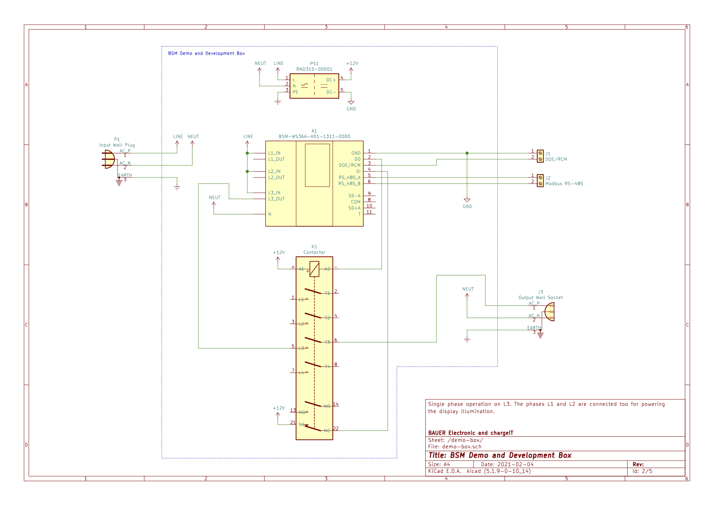

# Prerequisites

## Hardware Setup


Playing with the examples for electric vehicle charging requires a setup with a
contactor as showin in the image below. The [schematic is also available
PDF](img/bsm-demo-box-schematic-20210204.pdf).



Connect pin 2 of J1 to +12V to enable contactor operation.

For just playing with Modbus communication and a signed snapshot, it is
sufficient to just power the meter and connect a RS-485 interface.


## Python 3

The tools used in these examples require the runtime for the Python language to
be installed on your system. You will need version 3.7 or higher.


### Linux and macOS

On a typical Linux or macOS desktop system, Python 3 should be available out of
the box and you should get a version information similar to:
```
$ python3 --version
Python 3.9.1
```

### Windows

Windows does not come with Python 3 installed. So pick the latest release from
<https://www.python.org/downloads/> and install it. Check _Add Python 3.x to
PATH_ in the install wizzard for having Python immediately at hand at the
command line interface later.


### Search Path for Command Line Scripts

We are using Python package command line scripts to provide the BSM Tool. On
Windows this directory is automatically added to your search path where on
Linux and macOS you have to manually add it. This directory is typically
`$HOME/.local/bin` and on macOS `$HOME/Library/Python/3.9/bin`. You have to
take care for your actual Python version in the latter case.


## BSM Python Support

We provide installation packages on GitHub. These packages can be installed
with Python's package installer pip3 which should have been installed along
with Python. You should get a version information similar to:
```
$ pip3 --version
pip 20.3.3 from /usr/local/lib/python3.9/site-packages/pip (python 3.9)
```

Having Python 3 and its Package Installer ready, you could easily install the
BSM-WS36A Python Support as follows:
```
$ pip3 install https://github.com/chargeITmobility/bsm-python/releases/download/release-0.10.1/bauer_bsm-0.10.1-py3-none-any.whl
```

Now you should be able to run the BSM tool and display its help output
```
$ bsmtool --help
usage: bsmtool [-h] --device DEVICE [--baud BAUD] [--timeout SECONDS] [--unit UNIT] [--chunk-size REGISTERS] [--trace]
               [--verbose] [--public-key-format {der,raw,sec1-compressed,sec1-uncompressed}]
               COMMAND ...

BSM Modbus Tool

positional arguments:
  COMMAND               sub commands
    models              list SunSpec model instances
    export              export register layout
    get                 get individual values
    set                 set values
    create-snapshot     create snapshot but don't fetch data
    get-snapshot        create snapshot and fetch data
    verify-snapshot     verify snapshot signature (but do not create it)
    verify-signature    verify arbitrary signature for a given public key and digest
    ocmf-xml            generate OCMF XML from already existing snapshots (stons and stoffs)
    dump                dump registers
    version             print version

optional arguments:
  -h, --help            show this help message and exit
  --device DEVICE       serial device
  --baud BAUD           serial baud rate
  --timeout SECONDS     request timeout
  --unit UNIT           Modbus RTU unit number
  --chunk-size REGISTERS
                        maximum amount of registers to read at once
  --trace               trace Modbus communication (reads/writes)
  --verbose             give verbose output
  --public-key-format {der,raw,sec1-compressed,sec1-uncompressed}
                        output format of ECDSA public key (see RFC 5480 for DER and SEC1 section 2.3.3 for details
                        about formats)

You may specify communication parameters also by environment variables. Use BSMTOOL_DEVICE, BSMTOOL_BAUD,
BSMTOOL_UNIT, BSMTOOL_TIMEOUT, and BSMTOOL_CHUNK.

and you are ready to go.
```


## PyModbus

The BSM Tool does not allow accessing arbitrary register spans. For example, it
always reads the whole register span of a model instance. Therefore some
examples also use [PyModbus](https://github.com/riptideio/pymodbus)'s console
application `pymodbus.console` which you could install with:
```
$ pip3 install pymodbus prompt_toolkit
```
